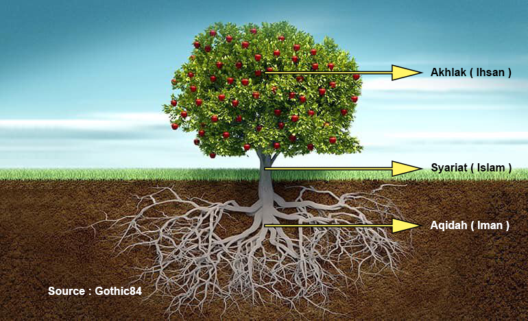

# Materi 1 - Iman Islam dan Ihsan

Segala puji kita panjatkan kehadirat Allah subhanahu wa ta’ala. Berkat Rahman dan Rahim Nya, yang telah menurunkan ilmu dengan segenap inkisyaf nya melalui para nabi, para rasul, para wali, para guru, mursyid. Sehingga, kita semua berkesempatan untuk mempelajari, memahami, dan mengamalkan ilmu tauhid sebagai penuntun dalam menjalani kehidupan ini, dengan mengharap ridho Allah menuju jalan keselamatan.

Banyak di antara kita yang mempelajari dan memahami ilmu tauhid, tapi hanya Sebagian saja yang benar benar mengamal kan dan menjadikan nya sebagai dasar penuntun hidup. Sehingga, banyak diantara nya yang memiliki ilmu agama, tetapi tidak bisa membawa keselamatan untuk hidup nya.

Islam, adalah agama rahmatan lil alamin. rahmat bagi alam semesta. yang jika kita berpegang teguh pada ajaran nya maka akan selamat dunia dan akhirat. dan jika ilmu tersebut diajarkan kembali, maka akan menyelamat kan yang mempelajari nya.

Mudah mudahan, melalui ihktiar tulisan ini, kita bisa saling menuntun kepada jalan keselamatan.

Aamiin yaa rabbal ’aalamiin.

Mari kita mulai pembahasan dari mempelajari kedua hadists riwayat berikut ini:

Dari Abu Said al-Khudri, Rasulullah saw bersabda: “Imam Mahdi akan keluar dari generasi akhir umatku. (Di saat pemerintahannya) Allah swt menurunkan banyak hujan, dan bumi mengeluarkan banyak tumbuhan. Dia memberikan harta dengan adil, hewan ternak menjadi banyak, dan umat manusia menjadi mulia. (al-Hakim dalam kitabnya “al-Mustadrak”, no: 8673, ia mengatakan: Hadis ini sanadnya sahih, dan disepakati oleh imam al-Zahabi).

Dari Abu Said al-Khudri, Rasulullah saw bersabda: “Dia akan memimpin umatku selama tujuh tahun atau sembilan tahun. Pada zaman itu, umatku akan mendapat kenikmatan yang belum pernah mereka rasakan sebelumnya. Mereka akan memperoleh banyak makanan dan mereka tidak akan menyimpannya. Pada ketika itu, harta melimpah-ruah. Ada seseorang yang mengatakan, ‘Wahai Imam Mahdi, berilah aku sesuatu. Maka Imam Mahdi berkata: Ambillah semua yang kamu mau”. (Sunan Ibnu Majah, no: 4073).

dari kedua riwayat tersebut, saya berkesimpulan bahwa umat muslim di akhir zaman, akan berada di suatu wilayah, dan di pimpin oleh satu orang yang selama ini kita kenal dengan sebutan Imam Mahdi.

dan hal ini sesuai dengan petujuk Allah, dalam ayat Quran surah Al Waqiah ayat ke 13, ayat ke 14, ayat ke 15 dan ayat ke 16 yang berbunyi.

“ṡullatum minal-awwalīn, wa qalīlum minal-ākhirīn.”

“segolongan besar dari orang-orang yang terdahulu, dan segolongan kecil dari orang-orang yang kemudian.”

‘Alā sururim mauḍūnah(tin).

“(Mereka berada) di atas dipan-dipan yang bertatahkan emas dan permata”

Muttaki'īna ‘alaihā mutaqābilīn(a).

“seraya bersandar di atasnya saling berhadapan.”

Yang jika kita ambil makna dari ayat tersebut, maka umat islam sangat banyak pengikut nya pada generasi awal, tapi sangat sedikit sekali pada genearsi akhir.

Lalu ada satu riwayat yang mengatakan “Jika terjadi hari kiamat sementara di tangan salah seorang dari kalian ada sebuah tunas, maka jika ia mampu sebelum terjadi hari kiamat untuk menanamnya maka tanamlah.” (HR. Bukhari\&Ahmad)

Ini menunjukan dan memberikan pembelajaran, bahwa ranah kita sebagai hamba hanyalah sebatas ikhtiar. dan kita memperoleh amal dari setiap ikhtiar yang kita laksanakan, bukan dari hasil yang kita dapat kan.

Seperti hal nya perumpamaan yang di sampaikan dalam riwayat tersebut. padahal kita tahu bahwa besok akan tiba kiamat, dan kita masih berikhtiar untuk menanam pohon, agar kita mendapat kan pahala dari hal tersebut, bukan berharap bahwa pohon tersebut akan membuahkan hasil untuk hari esok.

Begitu pun untuk tulisan ini. ini hanya sekedar ikhtiar, untuk membuka wawasan dan cakrawala berfikir kita, untuk mempelajari dan memahami tentang bagaimana seharusnya kita beragama, dengan pemahaman yang kembali kepada fitrah kita sebagai manusia. Dengan harapan kita bisa membenahi keimanan, yang selanjutnya ikut terbenahi nya ke Islaman, dan menjadikan kita seorang Ihsan.

Karena tidak ada yang bisa di jadikan patokan selamat nya umat muslim di akhir zaman, kecuali oleh itikad Iman nya. bukan oleh ke Islaman nya.

Ada ayat dalam Quran, yang jika kita bisa tepat memahami nya, insha allah kita akan termasuk dalam golongan umat muslim yang di selamatkan di akhir zaman.

Karena, kehidupan yang awal nya Hitam dan Putih, akan di kembalikan kepada Hitam dan Putih.

Hitam dan putih nya kehidupan di awali oleh sejarah Qabil dan Habil, dan di akhir zaman ini,akan di tutup hitam putih nya oleh kehadiran Imam Mahdi melawan Dajjal.

Quran surah Ibrahim ayat 24 dan ayat 25, yang mana dalam ayat tersebut Allah membuat suatu permisalan (perumpamaan). Yang mana, jika Allah membuat perumpamaan, maka hal tersebut menunjukan sesuatu yang harus kita pahami dengan benar makna nya. Sehingga,membutuh kan alat bantu berupa permisalan, dengan harapan kita bisa lebih mudah dalam mehahami apa yang di maksud dalam ayat tersebut.

“a lam tara kaifa ḍaraballāhu maṡalang kalimatan ṭayyibatang kasyajaratin ṭayyibatin aṣluhā ṡābituw wa far'uhā fis-samā\`”

“tu\`tī ukulahā kulla ḥīnim bi\`iżni rabbihā, wa yaḍribullāhul-amṡāla lin-nāsi la'allahum yatażakkarụn”

“Tidakkah kamu memperhatikan bagai-mana Allah telah membuat perumpamaan kalimat yang baik seperti pohon yang baik, akarnya kuat dan cabangnya (menjulang) ke langit,

(pohon) itu menghasilkan buahnya pada setiap waktu dengan seizin Tuhannya. Dan Allah membuat perumpamaan itu untuk manusia agar mereka selalu ingat.”

Dalam ayat tersebut, Allah mengumpamakan sebuah kalimat yang baik. Dan kalimat tersebut yaitu “La ilaha illallah”. Jika di perumpamakan kepada pohon yang baik, yaitu pohon yang memiliki ciri sebagai berikut.

<figure><figcaption></figcaption></figure>

1\) Akar nya menghujam kuat di dalam tanah

2\) Batang nya menjulang tinggi dan kokoh.

3\) Berbuah di setiap musim.

Yang kita semua pahami, pohon apapun itu, semua bergantung pada akar nya. yang mana jika akarnya bagus maka akan berbatang sehat, dan menghasilkan buah yang sehat.

Begitu pula sebalik nya, jika pohon berakar buruk, maka menghasilkan batang yang rapuh dan menghasilkan buah yang kurang baik.

Dan dalam hal ini, akar tersebut di umpamakan kedalam perkara hati. Seperti hadist Rasulullah yang menyebutkan “keadaan kehidupan manusia, tergantung kepada segumpal daging, yang terletak di dalam dada sebelah kiri nya”. Jika daging tersebut bagus, maka kehidupan nya pun akan bagus. dan jika daging tersebut rusak, maka kehidupan nya pun akan terbawa rusak. Dan daging tersebut adalah Hati (qalbu).

Seperti hal nya akar pohon, hati manusia terletak di dalam tubuh yang tidak bisa kita lihat secara langsung. Tapi, sangat menentukan apa yang jadi jalan kehidupan nya.

Sedangkan batang, bisa kita lihat karena berada di atas tanah. Dan jika kita pahami hadist di atas, ini jadi permisalan untuk kehidupan seseorang. Hati yang di olah dalam kehidupan, akan membuah kan sikap yang berupa akhlak.

Hati, merupakan sebuah tempat yang di ciptakan Allah, untuk menyimpan itikad (aqidah / keyakinan). Sedangkan kehidupan, merupakan sebuah tempat untuk berjalan nya syariat (aturan hidup) yang di turun kan Allah melalui para rasul Nya. Sedangkan perilaku,adalah tempat untuk tercipta nya akhlak.

Maka dari itu, akar nya kita sebut “aqidah”. batang nya kita sebut “syariat”. dan buah nya kita sebut “akhlak”. Atau dalam istilah tauhid kita menyebut aqidah dengan sebutan “Iman”, syariat kita sebut dengan “Islam”, dan akhlak kita sebut dengan “Ihsan”. Jadi,iman itu bertempat dalam hati. sedangkan Islam untuk menjalan kan kehidupan, dan akhlak merupakan buah dari perilaku yang di dasari oleh iman dan islam. Mari kita perluas lagi mengenai pengertian tentang apa itu Iman, Islam dan Ihsan.

Kembali ke pemahaman surah Ibrahim ayat 24 dan ayat 25 di atas. maka, iman itu bisa kita artikan merupakan suatu hal, yang menjadi ukuran baik dan tidak nya hubungan manusia sebagai hamba dengan Tuhan nya. Jika bahasa sunda disebut dengan “pangeran”, bahasa inggris di sebut dengan “God”, bahasa arab di sebut dengan “Rabb”. Jadi, di sini kita belum menyebut nama “Allah subhanahu wa ta'ala”.

Tetapi baru tentang esensi ketuhanan. maksud nya, agar kita paham bahwa semenjak nabi Adam sampai dengan nabi Muhammad saw. Allah telah menurunkan 144.000 nabi, dan sebagian ada juga yang menyebut kan 124.000. yang mana dari semua para nabi tersebut, dalam hal keimanan, tidak ada satupun yang berbeda. dalam artian semuanya sama sama mengajarkan kepada kita, bahwa semua kehidupan, kenyataan, kejadian, tidak ada yang terjadi begitu saja. melain kan ada yang menciptakan nya, ada yang mengurus dan menjaga nya, mengatur rejeki nya dan itu adalah Tuhan.

Nah disini, setiap nabi memperkenalkan identitas Tuhan dengan sebutan yang berbeda beda. Nabi Muhammad saw, memperkenalkan Tuhan dengan nama “Allah subhanahu wa ta’ala”, tetapi nabi Isa berbeda lagi, memperkenalkan tuhan kepada umat nya dengan sebutan “Tuhan Allah”. Berbeda lagi dengan nabi Musa, yang memperkenal kan Tuhan dengan sebutan “yhwh atau yahweh”. Begitu pula dengan nabi ajaran hindu yang menyebut tuhan dengan sebutan “hyang widi”, begitu pula dengan nabi ajaran sunda yang memperkenalkan tuhan dengan sebutan “Ahung”.

Nah dalam hal ini, kita harus paham bahwa kita tidak perlu mempermasalahkan mana nama yang harus kita sebut, karena dalam ajaran umat nabi Muhammad saw pun ada “99” nama Allah yang wajib di ketahui dan kita sebut sebagai “Asmaul Husna”. Adapun, berapa banyak nama Allah, itu hanya Allah yang tahu. Karena yang terpenting bagi kita adalah,memahami esensi ketuhanan. Karena dalam hal itikad iman, semua nabi tidak ada satupun yang berbeda.

Lalu selanjut nya, pengertian tentang Syariat. di antara 144.000 nabi, ada 313 yang Allah angkat menjadi Rasul, dan membawa syariat yang berbeda.

Mengapa demikian?

Karena dalam kehidupan ini, semenjak zaman nabi Adam sampai dengan kehidupan kita hari ini, Allah menunjukan kita hanya ada dua jalan. yaitu jalan iman, dan jalan nafsu. Allah memberitahu kita, melalui Quran surah Al-Balad ayat 10 berikut ini.

“wa hadaināhun-najdaīn”

“Dan Kami telah menunjukkan kepadanya dua jalan (kebajikan dan kejahatan)”

Diantara 313 nabi, yang wajib umat muslim ketahui adalah 25. dan di antara para 25 nabi tersebut, ada 4 Risalah yang wajib di ketahui. Yaitu: Taurat, yang Allah wahyukan kepada nabi Musa. Zabur, kepada nabi Daud. Injil, kepada nabi Isa. dan terakhir, Al Quran kepada nabi Muhammad saw.

Para nabi tersebut, Allah utus untuk menuntun kita kepada jalan “siratal-mustaqim” (menuntun kepada jalan yang lurus). Yaitu, kembali kepada jalan Iman (bertaubat). Karena sejak manusia di ciptakan hingga saat ini, ada data yang terus berulang ulang. Yaitu, ketika umat manusia kehidupan nya mulai mengikuti jalan hawa nafsu, dikarenakan akal dan kehidupan manusia yang terus berkembang seiring berjalan nya waktu. Sehingga, banyak umat manusia yang kehidupan nya mulai menyimpang dari fitrah nya, dan melakukan kemaksiatan. disitulah Allah mengutus seorang Nabi.

Dan pada saat nabi tersebut masih hidup, sebagian besar umat nya tetap beristiqomah dalam jalan keimanan. Tetapi, Ketika nabi tersebut wafat, umat nya perlahan lahan cenderung mengikuti kembali hawa nafsu, seiring dengan perkembangan kehidupan nya. Dan Ketika kemaksiatan nya sudah semakin mendominasi kehidupan, Allah mengutus kembali saorang Nabi. Dan kejadian itu terus berulang dan berulang. sampai dengan risalah terakhir yang Allah turunkan sebagai mukjizat terbesar, yaitu Al Quran. yang Allah wahyukan kepada nabi Muhamad saw.

Lalu, mengapa agama yang dibawa Nabi Muhammad di namakan Islam?

Karena, Nabi Muhammad saw adalah orang arab. kedua orang tua nya pun orang arab.bahasa sehari hari yang digunakannya pun bahasa arab. Sehingga, malaikat Jibril pun di perintah kan Allah menyampaikan wahyu kepada Nabi Muhammad untuk menggunakan bahasa arab. Dinamakan lah ajaran itu menggunakan bahasa arab, yaitu Islam. yang berasal dari dasar kata “aslama yuslimu islaman”. Yang memiliki arti selamat dan menyelamatkan.

Nah, semua risalah yang di bawa oleh para nabi adalah untuk menyelamatkan, maka sejati nya semuanya pun Islam. dalam arti tidak ada satupun risalah yang tidak menyelamat kan.

Jadi, jika akal kita berpendapat seandai nya, ajaran itu di turun kan di Indonesia, dan nabi yang menerima wahyu nya pun orang Indonesia, yang sehari hari berbahasa Indonesia,sudah tentu, menamakan ajaran itu dengan kata yang berbahasa Indonesia. Misalkan:“Agama Selamat”. itu adalah hal yang wajar. Karena, yang di maksud Islam bukanlah identitas nya, melainkan sifat nya. Untuk yang memeluk nya selamat, di ajarkan kepada orang lain, menyelamat kan. Maka, syariat Islam adalah hal yang menjadi ukuran baik dan tidak nya, hubungan manusia dengan rasul nya.

Umat Muslim dengan Nabi Muhammad, umat Nasrani dengan nabi Isa, dan umat Yahudi dengan nabi Musa.

Itulah penjelasan secara rinci, mengapa risalah yang di turunkan kepada para nabi berbeda beda. Karena, di turunkan pada waktu yang berbeda, keadaan zaman yang berbeda, dan pola kehidupan manusia yang saat itu tentu berbeda pula. Tetapi semuanya memiliki fungsi yang sama, yaitu untuk menyelamatkan.

Selanjutnya, mari kita pelajari pengertian tentang Ihsan.

Ihsan adalah, ukuran baik dan tidak nya, hubungan manusia dengan sesama manusia lain nya. Maka dalam hal ini, Quran surah Ibrahim ayat 24 dan 25 di atas kita pahami dengan arti: Jika dalam hati seseorang memiliki Aqidah iman yang baik (hubungan dengan Tuhan nya baik). maka, dalam kehidupan sehari harinya pun, akan menjalan kan Syariat yang di ajarkan oleh Rasul nya dengan baik. sehingga, lahir lah dari orang tersebut Akhlak yang baik.

Begitu pun sebalik nya, jika dalam hati seseorang tidak memiliki Aqidah iman yang baik.maka, dalam kehidupan sehari hari nya pun, jangankan menjalan kan syariat yang di ajarkan oleh Rasul nya, menjaga nya pun tidak. Sehingga, dari orang tersebut tidak ada akhlak yang baik.

Lalu, apa yang menjadi ciri seseorang bisa dikatakan dalam hati nya terdapat iman, yang memiliki ciri, baik nya hubungan antara diri dengan Tuhan nya?

Maka di sini, ciri nya adalah Takdir. Maksud nya, ketika seseorang dalam hidup nya telah menerima segenap takdir yang Allah garis kan dalam hidup nya, maka orang tersebut telah sepenuh nya, menerima kepada sang pencipta takdir dalam hati nya.

Begitu pun sebalik nya, ketika seseorang tidak menerima setiap takdir yang Allah garis kan dalam hidup nya, maka orang tersebut tidak menerima sang pencipta takdir dalam hati nya.

Untuk lebih memperdalam pemahaman, kita mari kita buka Quran surah Al-A’raf ayat 172 berikut ini:

“wa iż akhaża rabbuka mim banī ādama min ẓuhụrihim żurriyyatahum wa asy-hadahum 'alā anfusihim, a lastu birabbikum, qālụ balā syahidnā, an taqụlụ yaumal-qiyāmati innā kunnā 'an hāżā gāfilīn”

“Dan (ingatlah) ketika Tuhanmu mengeluarkan dari sulbi (tulang belakang) anak cucu Adam keturunan mereka dan Allah mengambil kesaksian terhadap roh mereka (seraya berfirman), “Bukankah Aku ini Tuhanmu?”

Mereka menjawab, “Betul (Engkau Tuhan kami), kami bersaksi.” (Kami lakukan yang demikian itu) agar di hari Kiamat kamu tidak mengatakan, “Sesungguhnya ketika itu kami lengah terhadap ini.”

Ketika kita masih berada di alam Ruh, Allah telah meminta kesaksian kepada kita dengan bertanya: “a lastu birabbikum”?.
yang arti nya: “Bukankah Aku ini Tuhanmu?”.

Dan saat itu, ruh seluruh anak cucu adam, yang tentu nya termasuk kita, saat itu menjawab:“qālụ balā syahidnā”. yang arti nya: “Betul (Engkau Tuhan kami), kami bersaksi.”

Maka, disana lah Allah menuliskan garis takdir untuk setiap hamba nya masing masing, yang kemudian di simpan nya tulisan itu di lauhul mahfuz.

Lalu ,di tiupkannya Ruh itu kedalam jasad, dan lahir lah kita ke alam dunia ini, dengan membawa iman yang masih dalam keadaan Mauquf (iman yang temporer).

Maka, mulai lah kita menjalani ujian di alam dunia ini, dengan setiap takdir takdir yang telah Allah tuliskan untuk kita. Nah, dalam perjalanan hidup ini lah, kemungkinan perubahan iman kita yang asal nya Mauquf itu, akan menjadi 2 pilihan, yaitu memegang iman yang Maqbul, atau memegang iman yang Mardud.

Dalam hal keimanan ini, banyak orang yang meyakini sudah memiliki iman, dengan percaya kepada ada nya Allah. Padahal, ukuran keimanan seseorang tidak cukup hanya dengan percaya. karena di Alam dunia ini, tidak ada satupun mahluk yang tidak percaya kepada Allah. termasuk orang orang kafir sekali pun, mereka percaya adanya Allah. Namun, yang menjadi permasalahan nya adalah, mengakui dan tidak mengakui nya.

Maka dalam hal ini, Takdir lah yang menjadi ukuran nya. Dan jika kita sudah memahami tentang apa itu takdir, Maka sesungguh nya, segala sesuatu yang terjadi di alam dunia ini, tidak pernah ada yang kebetulan. Jangankan, kehidupan kita sebagai manusia. Seperti hal nya sepucuk daun yang jatuh di tengah hutan, kapan jatuh, kapan menjadi kompos, sehingga kapan menjadi pupuk yang menyuburkan tanah pun, itu sudah tertulis di lauhul Mahfudz.

Iman maqbul, artinya iman yang diterima. Yaitu, imannya orang-orang yang beriman (mukmin). Maksudnya ialah, imannya orang-orang yang betul-betul iman kepada Allah dan Rasul Nya, tidak bercampur syirik dan tidak ada keraguan lagi di dalam keimannya. Sedangkan Iman mardud, artinya iman yang ditolak, yaitu imannya orang-orang munafik.

Ada sebuah kisah dalam hadist nabi, yang kisah ini cukup populer. Yaitu tentang seorang mantan pelacur, yang telah bertaubat. Dia memberi minum seekor anjing, yang sedang kehausan. dan oleh amal nya itu, Wanita tersebut masuk Surga. Ini memberikan pelajaran kepada kita, bahwa amal sekecil apapun, jika di dasari oleh iman yang Maqbul, amal tersebut Allah terima.

Sedangkan dalam riwayat yang lain, diceritakan bahwa ketika di yaumul mizan, banyak orang yang terkaget kaget. karena saat di buka buku catatan Amal nya, yang ternyatakosong.

Padahal, semasa hidup nya orang orang tersebut ahli ibadah. Ini memberikan pelajaran kepada kita bahwa sebanyak apapun amal, jika di dasari iman yang Mardud, amal tersebut tidak di terima.

Kita ambil contoh berikut ini:

Ada orang, yang ketika semenjak bangun tidur, dia berterima kasih kepada Allah, lalu pergi mandi seraya mengucap do’a, dilanjut kan sarapan dengan bersyukur dan mengingat Allah atas rezeki nya di pagi itu, kemudian berangkat kerja meminta perlindungan Allah agar di beri keselamatan, lalu selama bekerja tak henti nya mengingat Allah, sampai ketika mau beranjak tidur pun, ia panjatkan do’a kepada Allah. Maka bisa di katakan, orang tersebut menjalani takdir dalam keseharian nya, dengan keadaan taat kepada Allah.

Lalu ada orang, yang dalam keseharian nya banyak melakukan amal ibadah, tapi bertujuan untuk mengejar dunia. sholat 5 waktu di jalan kan, tetapi dalam setiap sholat nya tidak membawa pengabdian, ketaatan, kesetiaan, atau pun syukuran kepada Allah. Jadi, sholat nya hanya sebatas kebiasaan dan rutinitas. kemudian berdzikir dan berwirid, tapi untuk kepentingan dunia. maka bisa di katakan orang tersebut beribadah dalam keadaan bermaksiat.

Maksud dari maksiat di sini, bukan bentuk pelanggaran syariat. Tapi, merupakan lawan atau kebalikan dari taat. Jadi, taat dan maksiat di sini tidak menilai bentuk nya, melain kan menggambarkan keadaan hati.

Maka dari itu, akar keimanan dalam hati kita, sangat menentukan diterima dan di tolak nya amal yang kita jalan kan. Jika iman nya Maqbul, sekecil apapun di pastikan di terima. jika Iman nya Mardud, sebanyak dan sebagus apapun amal yang di perbuat akan di tolak.

Kita kembali ke surah Al Balad ayat 10 “wa hadaināhun-najdaīn”. Disini, Allah menerangkan kepada kita bahwa, dalam kehidupan ini hanya ada dua jalan. yaitu jalan iman, dan jalan nafsu. Jalan yang Allah ridhoi, yaitu hanya jalan Iman. dan ke 313 Risalah yang Allah turunkan kepada para nabi lah yang menuntun kita kepada jalan itu.

Dalam Quran, surah Ali Imran ayat 19 ada kalimat: “innad-dīna 'indallāhil-islām”. sesungguh nya, “din” yang Allah ridhoi ialah Islam. Yang dalam artian, Islam itu bukan hanya syariat yang di bawa oleh nabi Muhamad saja. karena syariat nabi Musa pun, Islam. yaitu selamat dan menyelamat kan. syariat nabi Daud, Islam. yaitu selamat dan menyelamatkan. syariat nabi Isa pun Islam, yaitu selamat dan menyelamatkan.

Jadi, kata “din” tidak hanya berarti agama. Karena, kata “din” bisa berubah arti, sesuai dengan kalimat yang di masuki nya. Seperti, “māliki yaumid-dīn”. yang memiliki arti “Hari Pembalasan”. dan ada juga, “fī dīnil-maliki illā ay yasyā\`allāh”.Yang berarti “Hukum Allah”. Jadi yang di maksud “Din”, di sini adalah syariat / ajaran hidup.

Ada ajaran hidup, yang bukan bersumber dari Allah, dan yang membawa nya pun bukan Rasul. Tapi dari hasil karya akal manusia, dan hasil olah kebudayaan. Dan parah nya lagi,nyaris semua manusia saat ini, tidak ada yang lolos dari pemahaman ajaran ini. yang selama ini kita sebut “Materialisme”. Dan secara tidak sadar, kita menjalankan ajaran ini dalam kehidupan sehari hari. Sehingga, kita tidak merasakan nya, tetapi meyakini kebenaran nya.

Bukti dari nyaris tidak ada manusia yang lolos dari ajaran materialisme ini adalah, orientasi hidup nya mengejar dunia. Yang setiap aktifitas nya, bertujuan untuk kepentingan kepentingan duniawi. Bahkan, termasuk ranah beramal dan beribadah pun, di maksud kan untuk tujuan duniawi. Jika tidak percaya, silahkan bertafakur, dan bertanya ke dalam isi hati masing masing, jalan hidup masing masing, dan tujuan hidup masing masing.

Ketika seseorang dalam hati nya sudah berakar “Materialisme”, maka jalan kehidupan nya pun akan berbatang “Kapitalisme”, dan buah dalam kehidupan nya pun, menjadi “Hedonisme”. Dan jalan ini lah yang Allah sebut dengan jalan nafsu, yaitu jalan yang tidak Allah Ridhoi.

Jadi, dalam kehidupan kita hanya ada 2 jalan. yaitu jalan Islam, dan jalan Materialisme.

Jalan Islam, mengajak manusia untuk mempersiapkan bekal manuju Akhirat, sedangkan jalan materialisme, mengajarkan manusia untuk menikmati kehidupan Dunia. Jadi, Di sini kita berbicara keadaan Hati. Jika hati manusia orientasi nya untuk Akhirat, maka dunia baginya, hanyalah tempat persinggahan untuk menabung amal kebaikan yang akan di bawa ke akhirat nanti. Sedangkan materialisme sebalik nya, yaitu mengajak manusia menikmati kesenangan duniawi, dan akhirat di lupakan.

Dan ini bisa di bukti kan. banyak manusia yang setiap hari nya menjalankan syariat, dan beramal dalam kebaikan, tetapi memiliki tujuan untuk dunia. Seperti bersedekah, tetapi ingin balasan harta duniawi yang melimpah. Beramal, tetapi dalam hati nya ingin di puji demi kepuasan hati. Beribadah, tetapi demi melancarkan kepentingan nya.

Mengapa? Karena orientasi hati nya Materialisme.

Jika akar hati nya materialisme, maka otomatis, pola hidup nya pun kapitalisme. Yaitu, perhitungan. Tenaga di hitung, waktu di hitung, ilmu pun di hitung. Memberikan tenaga berharap balasan, memberikan waktu berharap balasan, dan memberikan ilmu pun berharap balasan.

Sedangkan syariat Islam sebalik nya, jika beramal dengan tenaga dirasa kurang, dia tambah dengan beramal waktu, masih terasa kurang dia tambah beramal ilmu, masih terasa kurang ia tambah beramal harta. Dalam urusan balasan, dia pasrahkan segalanya hanya kepada Allah. karna dia punya keyakinan, Allah tak akan pernah ingkar terhadap hamba nya.

Kapitalisme mengajarkan, jika bermodal seminimal mungkin, jika meraup untung semaksimal mungkin. yang akhirnya, membuahkan hedonisme. Yaitu, tidak ada hal yang lebih nikmat bagi nya, selain kesenangan dunia. itulah pintar nya tipu daya dajjal, yang membuat sensasi hidup di dunia ini, seindah layak nya surga. Sehingga, orang orang yang terlena, tidak ada keinginan untuk menuju surga yang berada di Akhirat.

Mudah mudahan, sampai sini kita mulai bisa paham. maksud dari dua jalan yang Allah sebut kan, yaitu jalan iman, dan jalan nafsu. Karena ini lah jalan yang sesungguh nya membawa kesesatan hidup manusia di akhir zaman. yaitu paham materialisme, yang akhirnya membuat blunder isi akal dan fikiran kita dalam beragama saat ini.

Sehingga, sering kita melihat konflik atas dasar agama. dengan istilah mengkafir kafir kan orang lain. Padahal, secara tidak sadar, akar dalam hati nya pun sudah kafir. yang dalam hati seharus nya memiliki pondasi aqidah iman, sudah berganti dengan pondasi materialisme.

Dan sering pula kita mendengar istilah pindah agama. Padahal, yang sebenar nya, jalan hidup nya pun tanpa di sadari sudah berpindah. yang seharus nya menjalankan syariat islam, menjadi jalan hidup kapitalisme. Sehingga, tujuan hidup nya pun sudah berpindah. yang seharus nya beramal dan beribadah untuk akhirat, berubah haluan menjadi mengejar kesenangan dunia.

Disini lah, penting nya kita memahami syariat yang di bawa oleh para nabi. agar kita tidak salah dalam menyikapi nya. Sehingga, ketika seseorang mempelajari dan memahami seperti apa syariat Islam, lalu dia ingin menjadikan islam sebagai jalan hidup nya. maka, pensikapan yang tepat adalah “Menerima” ajaran Islam, bukan “Pindah”.

Mengapa? Seperti yang sudah di jelaskan sebelum nya. Bahwa semua syariat yang di bawa oleh para nabi, adalah untuk menyelamat kan. Dan syariat yang terakhir, Allah wahyu kan kepada nabi Muhammad saw. melalui salah satu mukjizat nya, yang selama ini kita sebut dengan kitab Al Quran. yang menjadi penyempurna kitab-kitab sebelum nya.

Untuk itulah, mengapa kita harus belajar memastikan bahwa akar dalam hati kita adalah Iman. agar kita yakin dalam setiap syariat kehidupan yang di jalan kan, menjadi amal sholeh yang diterima. sehingga, menjadikan kita seorang Ihsan.

Lalu, apa yang menjadi ciri bahwa dalam hati kita terdapat iman? Dalam pembahasan sebelumnya sudah di sebut kan. Yaitu, baik dan tidak nya hubungan antara manusia sebagai hamba dengan Tuhan nya. Dan yang menjadi tolak ukur nya adalah sakaratul maut.

Begini penjelasan nya: Jika seseorang, memiliki hubungan baik dengan tuhan nya, ketika sakaratul maut datang, proses nya mudah waktu nyapun tidak lama. Begitu pula sebalik nya. Jika seseorang, memiliki hubungan yang tidak baik dengan tuhan nya, ketika sakaratul maut datang, proses nya tidak mudah, dan orang nya pun merasa tersiksa.

Mari kita bahas lebih dalam lagi mengenai sakaratul maut ini. dan mengapa dijadikan ukuran hubungan baik dan tidak nya antara hamba dengan tuhan nya. Yang pertama, ini bisa di jadikan ciri yang akurat. karena, saat proses sakaratul maut, kita tidak bisa berpura-pura dengan ekspresi nya. yang sakaratul maut nya bagus akan berjalan dengan lancar, dan dalam waktu yang singkat. sedangkan yang sakaratul maut nya tersiksa, dia tidak bisa menyembunyikan ekspresi perasaan sakit nya ketika proses sakaratul maut tersebut berjalan dan waktu nya pun tidak singkat.

Lalu yang kedua, ini adalah alamat pertama yang akan kita datangi, saat takdir kehidupan di dunia kita sudah selesai. Karena, kita semua pasti akan kembali kepada Allah. dan Allah memberitahu kita dalam Quran surah Al Anbiya ayat 35 berikut ini:

“kullu nafsin żā\`iqatul-maụt, wa nablụkum bisy-syarri wal-khairi fitnah, wa ilainā turja'ụn”

“Setiap yang bernyawa akan merasakan mati. Kami akan menguji kamu dengan keburukan dan kebaikan sebagai cobaan. Dan kamu akan dikembalikan hanya kepada Kami.”

Contoh sakaratul maut yang bagus, sering kita temui dalam kehidupan sehari hari. seseorang sedang sholat, dalam keadaan sujud, lalu meninggal. Atau contoh lain ketika seseorang sedang tidur, dan anggota keluarganya merasa tidur nya sudah terlalu lama, ketika di bangun kan ternyata sudah meninggal.

Lalu, ada hadist riwayat yang mengatakan: “Barang siapa yang bisa mengucap ‘La ilaha illallah’ di saat sakaratul maut nya, maka dia akan masuk syurga”.

Mengapa hal ini terkesan gampang? Kita harus paham duduk perkara nya. Disini, kita bukan membahas perkataan lisan, tetapi kita membahas perkara hati. Mengucap ‘La ilaha illallah’ menggunakan lisan, sangat berbeda dengan mengucap ‘La ilaha illalah’ menggunakan hati.

Contoh nyata nya apa? Ada saat-saat tertentu, dimana kita mengalami mimpi Buruk (mimpi yang di masuki syaiton), dan pada saat itu, kita ingin bangun tapi sangat susah. Kita mencoba membaca tahlil, atau pun istighfar namun tak terucap sepatah katapun.

Nah, ini menandakan bahwa kalimat-kalimat tersebut tidak ada dalam hati kita. Padahal, dalam aktifitas keseharian kita, kalimat-kalimat tersebut sering kita ucapkan secara lisan, namun tak ada satu pun yang tersimpan dalam hati.

Nah dalam hal ini, banyak orang yang berfikir, dan mencari cara. bagai mana cara nya supaya kalimat tersebut bisa masuk kedalam hati? Sehingga, ketika malaikat Izrail datang mencabut nyawa, bisa dengan mudah mengucap kan tahlil tersebut. dan berharap meninggal dalam keadaan selamat (husnul khatimah).

Ada yang berpendapat, di wirid kan dalam jumlah yang sangat banyak, dengan harapan, bisa masuk kedalam hati. Padahal, bukan dengan cara seperti itu. karena urusan syariat berbeda dengan urusan Iman.

Yang mana urusan itikad iman, harus di beres kan secara itikad iman. dan urusan syariat pun, harus di bereskan secara syariat.

Karena, hubungan itikad iman dan syariat adalah: syariat itu, untuk memelihara itikad iman. Sedangkan itikad iman yaitu, kekuatan untuk menjalankan syariat.

Maka dalam hal ini, cara melatih agar kalimat tahlil tersebut bisa masuk kedalam hati, adalah dengan membuat cara pandang yang baru dalam kehidupan sehari-hari kita.

Yaitu mulai saat ini, lihat lah segala sesuatu mulai dari keadaan, kenyataan, kehidupan, dan segala kejadian dengan cara: ini dari Allah, ini oleh Allah, ini milik Allah, dan ini akan kembali kepada Allah.

Teruslah berlatih dan berlatih dengan hal tersebut. nah perlahan-lahan mulai lah, kalimat tahlil tersebut muncul dalam hati kita. seperti sebuah tunas yang mulai tertanam dalam hati. dan seiring terlatih nya diri kita dengan hal itu, tunas tersebut pun mulai tumbuh layak nya pohon yang akar nya tertancap dalam hati kita.

Sehingga, jika suatu saat syaiton datang lagi kedalam mimpi kita, kita akan bisa mencari kalimat tersebut dalam hati dan melafadz kan nya dengan mudah dan lancar. Dan saat malaikat Izrail datang ketika kita sakaratul maut pun, kita sudah siap melewati proses nya.

Selanjut nya, banyak orang memahami, jika sakaratul maut itu adalah proses dicabut nya Roh, padahal bukan. Sakaratul maut itu adalah proses di cabut nya Nyawa.

Begini penjelasan nya, agar kita semakin mengerti untuk memahami nya. Manusia, secara garis besar nya tercipta dari dua unsur. Ada cangkang, yang kita sebut jasad, lalu ada isi, yang kita sebut Ruh.

Jasad, tercipta dari tanah yang mengandung unsur-unsur duniawi. yang mewarisi seluruh kehinaan-kehinaan dunia, dan juga mewarisi seluruh kelemahan-kelamahan dunia.

Sedangkan Ruh, tercipta dari Nur Muhammad, yang mewarisi seluruh kemuliaan-kemuliaan akhirat.

Kemudian, Allah persatukan lah Ruh dan jasad tersebut, di kunci oleh Nyawa. Dan di sebut lah Manusia. Karena, jika hanya jasad di sebut Mayit. Jika hanya Ruh di sebut Arwah. Jika keduanya bersatu dan memiliki nyawa jadilah manusia.

Nah, itulah proses dicabut nyawa yang kita sebut sakaratul maut. Dan sekarang pertanyaan nya, apakah itu nyawa?

Logika nya adalah, apa yang hilang dari manusia yang mati. Yaitu :

1\). Hidup nya hilang. Karena jasad nya ada, Ruh nya pun ada. tetapi hidup nya Allah ambil.

2\). Pengetahuan nya hilang. Karena otak nya ada, Ruh nya pun ada. Tapi pengetahuan nya Allah ambil.

3\). Keinginan nya hilang. Karena jasad nya di kubur, Ruh nya pulang ke barzakh. Tak bisa menolak, karena keinginan nya Allah ambil.

4\). Kemampuan nya hilang. Badan nya lengkap, Ruh nya pulang ke barzakh, tak mampu berbuat apa apa. karena kemampuan nya Allah ambil.

5\). Penglihatan nya hilang. Mata nya ada, Ruh nya pun ada. Tapi penglihatan nya Allah ambil

6\). Pendengaran nya hilang. Telinga nya ada, Ruh nya pun ada. Tapi pendengaran nya Allah Ambil.

7\). Ucapan nya hilang. Mulut nya ada, Ruh nya pun ada, Ucapan nya Allah ambil.

Nah, semua hal di atas jika kita sebut dengan bahasa arab adalah:

1\) Hayat.

2\) Ilmu.

3\) Iradat.

4\) Qudrat.

5\) Basar.

6\) Sama.

7\) Kalam.

Jadi, apa pengertian dari nyawa?

Yaitu sifat-sifat Allah, yang di titip kan di dalam diri Manusia.

Maka, dalam Al Quran surah Qaf ayat 16 ada kalimat:

“wa naḥnu aqrabu ilaihi min ḥablil-warīd”.

“Dan, Kami lebih dekat kepadanya dari pada urat lehernya.”

Dalam ayat ini lah Allah memberitahu kita bahwa, kehadiran nya sangat, sangat, dan sangat dekat sekali dengan kita.

Nah, dalam sakaratul maut ini lah Ruh kita, menyimpan data rekaman terakhir perjalanan hidup kita. Karena, setelah terlepas nya nyawa dalam diri kita, akal kita sudah tidak bisa menyimpan atau meng input data baru. Kalau di ibarat kan, mati nya manusia itu seperti perangkat yang sudah Off kan.

Ada catatan yang ingin di tambah kan di sini. Sesungguh nya, 40 hari sebelum malaikat Izrail menjemput kita dalam proses sakaratul maut, ada dua Ruh yang telah pulang terlebih dahulu. yaitu Ruh Rabbani dan Ruh Quds. Dua ruh ini lah, yang menjadi pondasi fungsi fitrah dalam hidup manusia.

Manusia, memiliki 7 Fungsi Ruh dalam diri nya yaitu:

1\) Ruh Hewani.

2\) Ruh Nabati.

3\) Ruh Jasmani.

4\) Ruh Rohani.

5\) Ruh Nurani.

6\) Ruh Rabbani.

7\) Ruh Quds.

\*\* Insha Allah, nanti kita bahas mengenai masing masing fungsi dari tiap-tiap ruh tersebut, dalam pembahasan selanjut nya.

Kita kembali ke pembahasan. Nah, jadi dua Ruh yang berfungsi fitrah tadi sudah pulang terlebih dahulu, 40 hari sebelum malaikat Izrail menjemput. maka, tersisa 5 fungsi Ruh dalam diri kita yang menunggu hingga tiba saat nya malaikat Izrail datang. lalu di cabut lah nyawa kita. Kemudian, keluar lah 4 Ruh yang tersisa tadi, sedangkan 1 fungsi Ruh tetap tersimpan dalam jasad, yaitu Ruh Jasmani. Dalam Fiqih imam Syafi’i menjelaskan, jika kita memandikan jenazah, harus dengan perlahan lahan. karena masih ada sisa rasa sakit dari proses dicabut nyawa nya.

Lalu, jika orang yang meninggal tersebut membawa iman yang Maqbul, seluruh 4 Ruh tersebut pulang ke Barzakh. Sebalik nya, jika membawa iman yang Mardud (meninggal dalam keadaan Kafir). Maka, 2 Ruh pulang ke Barzakh, 1 tertinggal dalam Jasad, dan 2 Ruh tertinggal di tempat di cabut Nyawa. Yang selama ini kita kenal dengan sebutan, Ruh Qorin.

Maka dari itu, seseorang yang meninggal dalam keadaan membawa iman maqbul, dia meninggal dalam keadaan sempurna. Sedangkan, orang yang meninggal dalam keadaan kafir, dia meninggal dengan keadaan tersiksa.

Mengapa?

Karena, keadaan Ruh Qorin, akan sesuai keadaan nya dengan ketika saat dia meninggal. Misal kan, ada seseorang yang mengakhiri hidup nya dengan cara menggantung diri dikarenakan depresi oleh permasalahan hidup nya, maka keadaan Ruh Qorin nya pun akan terus merasakan jeratan tali yang mengikat leher nya, sampai dia berhasil di sempurnakan.

atau hal lain, misal kan ada yang bunuh diri dengan cara menyayat nadi sampai dia kehabisan darah nya. Ruh Qorin nya pun akan terus merasakan sakit nya nadi yang tersayat, dan mati perlahan kehabisan darah nya akan terus dia rasakan selama almarhum belum di sempurnakan.

Maka dari itu, ketika seseorang sudah paham tentang hal ini, lalu kemudian bisa berkontak dengan Ruh Qorin, permintaan mereka hanya satu. Yaitu minta Ruh nya di sempurnakan. Karena hidup terpisah seperti itu sangat lah menyiksa. 2 Ruh di alam Barzakh, dan 2 Ruh tersesat di alam dunia yang sering kita kenal dengan Arwah gentayangan.

Ini menarik, karena saat ini, di zaman yang menurut kita serba modern ini, semakin sedikit orang yang paham mengenai perihal ini. Banyak di antara mereka yang menyebut nya sebagai “Takhayul”, atau ada juga yang meyakini bahwa ini adalah Jin kafir. Padahal, Ruh dan Jin adalah dua makhluk yang berbeda, dengan dua alam yang berbeda pula (Alam Arwah dan alam Jabarut).

Rasulullah Shallallahu ‘alaihi wa sallam bersabda,

“Zaman saling berdekatan, ilmu dihilangkan, berbagai fitnah bermunculan, kebakhilan dilemparkan (ke dalam hati), dan pembunuhan semakin banyak.“ (HR. Muslim).

Ilmu yang di cabut di akhir zaman di antara nya ada dua yaitu:

1\. Ilmu Tauhid

2\. Ilmu Faraid (ilmu waris)

Dan hari ini, hadists tersebut sudah terbukti. Banyak manusia yang mengakhiri hidupnya karena tidak kuat menghadapi berat nya tekanan di akhir zaman di karenakan tidak mengenal ilmu tauhid selama hidup nya. Dan merekapun tidak mengetahui perkara apa yang akan mereka hadapi setelah kematian nya.

Cara menyempurnakan Ruh Qorin untuk almarhum laki-laki, yaitu dengan membaca “Allahummaghfirlahu warhamhu wa’afihi wa’fuanhu”. Sedangkan untuk almarhumah perempuan dengan membaca “Allahummaghfirlaha warhamha wa’afiha wa’fuanha”.

Kita semua pasti mati. lalu, bagai manakah gambaran kematian itu?

Yang pertama:

Setelah ruh kita terlepas dari jasad nya, perasaan, penglihatan, pendengaran kita, sama persis seperti saat kita sedang bermimpi. Tetapi ada perasaan aneh dalam impan tersebut, yaitu apa yang kita impikan saat itu, sama persis dengan keadaan dan kenyataan saat itu juga.

Begini gambaran nya: kita ingat bahwa saat itu sedang tidur di bangsal rumah sakit, di temani anak dan istri. nah keadaan itu pula yang kita lihat saat itu. Kita melihat anak kita, istri kita, bahkan jasad kita pun, kita bisa melihat nya. lalu kita pun bertanya tanya, mimpi apakah ini?

Mengapa begitu terasa nyata? padahal saat itu kita telah meninggal, namun belum menyadari nya. Dan kita pun sangat berharap mudah mudahan bisa segera terbangun dari mimpi tersebut.

Lalu, jasad pun di bawa ke kamar Jenazah, Ruh kita pun ikut ke kamar jenazah. Jasad di bawa pulang dengan ambulance, Ruh kita pun ikut dalam ambulance tersebut. Sampai jasad di baringkan di tengah rumah di tutup kain, Ruh kita pun ada menyaksikan nya.

Karena jasad dan Ruh tidak bisa terpisah jauh, seperti ada tali yang mengikat. Lalu mulai berdatangan tamu yang melayat, Ruh kita pun tahu keadaan saat itu, bahkan ikut mendengar kan apa yang mereka obrol kan tentang perjalanan kita selama hidup. Baik itu kebaikan nya, atau pun keburukan nya, Ruh kita tahu yang mereka bicara kan.

Yang kedua:

Ini adalah puncak kesedihan, karena apapun yang terlihat, yang terdengar, yang di rasakan saat itu, itu adalah untuk yang terakhir kali nya. Kita melihat istri, melihat anak, bahkan melihat apa yang kita miliki selama hidup pun, itu untuk yang terakhir kali nya.

Yang ketiga:

Ini adalah puncak penyesalan, kemarin anak minta di belikan mainan, kita menyesal tidak segera membelikan nya. Kemarin berselisih dengan suami atau pun istri, kita menyesal belum sempat meminta maaf dan berbaikan lagi, bahkan melihat sajadah pun, kita menyesal mengapa sholat kita sering kali lalai.

Keadaan itu berlangsung terus sampai jenazah kita di mandikan. Karena pada saat itu kita serasa tidur kembali dengan keadaan yang sangat sangat pulas, sehingga tidak mengingat apapun lagi setelah itu.

Kita tidak mengetahui saat jenazah kita di sholat kan, lalu di bawa menggunakan keranda ke pemakaman.

Kemudian dimasukan lah jasad kita ke liang kubur, di tidur kan dengan posisi miring ke kanan dan menghadap kiblat. lalu di buka lah tali pengikat kafan. Dan pada saat tanah pertama menutup liang kubur, disanalah kita terbangun seolah olah di kaget kan saat kita sedang pulas pulas nya tidur.

Dan ini lah, alamat kedua yang akan kita datangi. setelah sakaratul maut dalam perjalanan kita menuju alam Akhirat.

Disana lah kita baru sadar bahwa ini lah yang di nama kan alam kubur, dan kita pun melihat jasad kita sudah terbungkus kain kafan. dan keadaan pun terus berlanjut hingga liang kubur kita sepenuh nya tertutup tanah, samar-samar kita masih bisa mendengarkan semua yang mengantarkan jenazah kita mendo’a kan. dan ustadz yang memimpin proses pemakaman pun mentalqin kan kita.

Hey fulan bin fulan, disebut nya nama kita. Sebentar lagi engkau akan di datangi malaikat Munkar dan Nakir yang akan memberikan pertanyaan pertama “Man rabbuka?”. Maka jawab lah “Allahu Rabbi”.

Jika semasa hidup kita sudah mengerti bahwa hal ini akan kita alami karena kita mengerti ilmu untuk mempersiap kan nya, maka kita akan dengan tenang bisa menjawab nya. Namun jika tidak punya persiapan akan hal ini, disinilah penyesalan terakhir kita. Disana kita menjerit sejadi jadi nya memohon pertolongan,dan memohon agar jangan di kubur kan, namun tak ada seorang pun yang bisa mendengarkan, apa lagi membantu kita di saat itu.

Dan ketika proses talqin telah selesai, kita ingin mengingat jawaban yang telah di beritahu untuk pertanyaan para malaikat tadi pun, tidak bisa sama sekali. padahal itu kalimat yang singkat “Allahu Rabbi”. Karena, saat itu otak kita sudah tidak berfungsi untuk menyimpan jawaban tersebut dalam akal. Karena sifat ‘ilmu” yang allah titipkan kepada kita semasa hidup sudah di ambil. Apa yang kita lihat, apa yang kita dengar, di olah oleh otak, di simpan dalam akal oleh sifat “ilmu”. Jadilah pengetahuan.

Mulai lah perjalanan Ruh kita di alamat ke dua ini di mulai. 7 langkah setelah orang-orang yang mengantar kita ke pemakaman beranjak pergi, lalu datanglah malaikat Munkar dan Nakir tersebut dan menanyai kita dengan pertanyaan “Man rabbuka?”.

Jika kita tidak bisa menjawab pertanyaan tersebut, maka di sanalah siksa kubur di mulai. Jasad kita lalah yang disiksa, namuh Ruh kita lah yang benar benar meraskan pedih nya siksaan tersebut.

Jika kita bisa menjawab nya, maka kita akan di suruh tidur kembali menunggu nanti di bangkit kan kembali di Alam Barzakh.

Nah disini lah alamat ke tiga yang akan kita datangi. Seluruh manusia yang di ciptakan mulai dari zaman nabi Adam, hingga manusia yang meninggal hari ini, berkumpul nya di alam Barzakh.

Lalu apa yang membedakan antara alam barzakh dan alam dunia?

Yang pertama yaitu, waktu terhenti. dan, di sini lah nikmat dan siksa kubur mulai berlaku. Yang dalam kubur nya mendapat kan nikmat akan seterus nya nikmat sampai dengan tiba nya hari kiamat.

yang mendapatkan siksa akan terus merasa tersiksa hingga tiba nya hari kiamat.

Yang kedua, perbedaan hidup di alam dunia dan alam barzakh yaitu saat di alam dunia kita memiliki jasad, sedangkan di alam barzakh tidak. Namun, keperluan untuk kebutuhan hidup tetap lah sama. Jika keperluan di alam dunia kita dapat kan untuk jasad dan Ruh, sedangkan di barzakh hanya untuk keperluan Ruh.

Maka dari itu, keadaan di barzakh pun berbeda beda. ada yang berkecukupan, ada yang serba kekurangan, ada yang biasa biasa saja.

Bahkan yang selalu kelaparan pun ada, yang rasa kelaparan tersebut sama persis seperti rasa nya kelaparan kita di dunia.

Kering nya tenggorokan, pahit nya ludah, perih nya perut sama persis.

namun jika saat di dunia, rasa lapar tersebut bisa hilang ketika kita mendapatkan makan dan minum. Sedangkan di barzakh tidak, rasa itu seterus nya begitu.

Maka dari itu, Rasulullah shallallahu ‘alaihi wa sallam bersabda.

“Jika seseorang meninggal dunia, maka terputuslah amalannya kecuali tiga perkara (yaitu): sedekah jariyah, ilmu yang dimanfaatkan, atau do’a anak yang sholeh” (HR. Muslim).

Apa itu sedekah jariyah? Yaitu sedekah yang langgeng. Seperti apakah contoh nya? Nah, disini lah kita harus mengenal ilmu waris (faraid), karena masih berkaitan dengan sedekah jariyah almarhum.

Begini penjelasan nya: Saat kita meninggal, lalu kita memiliki peninggalan harta berupa rumah, tanah, kendaraan, dan sebagai nya.

Kebanyakan orang saat ini berpemahaman, harta harta tersebut berpindah kepemilikan kepada angota keluarga. Padahal, sebenar nya tidak.

Harta peninggalan tersebut tetap lah milik kita. lalu apa kewajiban anggota keluarga terhadap harta tersebut?

Yaitu, mengantar kan nya ke barzakh. karena almarhum di sana masih membutuh kan kiriman amal kebaikan yang di atas namakan almarhum.

Misalkan: sebagian dari tanah peninggalan tersebut di waqaf kan, kemudian di bangun rumah ibadah, nah setiap semua yang beribadah di sana, almarhum kebagian pahala nya, tanpa mengurangi pahala orang yang beribadah tersebut.

Lalu sebalik nya, missal kan: tanah tersebut di perebut kan dan menimbulkan konflik di antara para anggota keluarga. Atau tanah tersebut di gunakan untuk jadi tempat kemaksiatan. Maka dosa dosa yang di akibat kan oleh anggota keluarga tersebut pun, itu akan turut mempersulit kehidupan alharhum di alam barzakh nya.

Selanjut nya ilmu yang bermanfaat: misalkan selama hidup kita mengajaran orang lain ilmu tentang ke akhiratan, sehingga orang tersebut yang asal jalan hidup nya gelap tanpa tujuan, karena asbabiah ilmu dari kita tersebut jalan hidup nya jadi ada perbaikan, nah selama ilmu tersebut memberikan manfaat untuk orang tersebut, kita kebagian pahala nya.

Lalu anak yang sholeh: Saat kita hidup kita mendidik anak anak kita dengan ilmu agama dan menjadikan nya orang sholeh, lalu kita meninggal dan anak kita jalan hidup nya terus dalam jalan yang sholeh, kita mendapat kan pahala dari anak tersebut, tanpa mengurangi pahala nya.

Nah, 3 perkara ini lah yang terus mengalir ke barzah untuk almarhum.

Sedekah Jariyah, ilmu yang bermanfaat, dan anak yang sholeh.

Nah sampai sini lah. penjelasan aqidah Iman yang di maksud baik dan tidak nya hubungan hamba dengan tuhan nya. Yaitu ketika menghadapi sakaratul maut, pertanyaan Malaikat Munkar dan Nakir di alam kubur, dan keadaan di alam barzakh, apakah di hinakan atau di mulia kan.

Lalu dalam kehidupan kita sehari hari, jika orang yang selama hidup nya tidak melaksanakan syariat sholat, namun ketika menghadapi sakaratul maut dia bisa menjalani nya dengan mudah, kita jangan heran karena sakaratul maut itu urusan hamba dengan tuhan nya, belum berurusan dengan rasul nya. seperti yang di jelaskan bahwa syariat itu hubungan baik dan tidak nya antara seseorang dengan Rasulnya.

Contoh kasus nya begini: ada seseorang yang selama hidup nya tidak menjalankan syariat ajaran Islam. salah satu yang kita ketahui di masyarakat ada aliran penghayat kepercayaan yang kita kenal sebagai “Sunda wiwitan”.

Nah selama hidup, orang tersebut berperilaku baik. jangan kan terhadap sesama manusia. terhadap binatang dan tumbuhan pun dia berperilaku baik. Dalam tradisi mereka, ketika menanam padi, memanen hasil tani dan sebagai nya mereka meminta izin “Leluhur” atau di sebut juga “Karuhun” mereka agar di beri keberkahan.

Mereka menjalan kan syariat kepercayaan nya dengan baik, hubungan dengan sesama nya pun baik. Maka ketika orang tersebut meninggal dan kita melihat proses sakaratul maut nya bagus, disini lah hal yang harus kita pahami dengan penjelasan di atas. Karena itu baru urusan hamba dengan Tuhan nya.

Lalu, urusan umat dengan Rasul nya. itu akan di mulai di negeri Akhirat setelah Kiamat. Disana lah kita memulai kehidupan yang sejati nya kehidupan, karena kehidupan di dunia ini hanyalah sementara. yang merupakan alam ujian untuk persiapan kita pulang kembali kepada sang pencipta.

Dan melalui ilmu ini lah kita bisa belajar dan berikhtiar untuk mempersiapkan sebaik baik nya perbekalan untuk kita nanti. Karena gambaran kehidupan kita saat ini bisa menjadi gambaran kehidupan kita di Akhirat nanti. Karena di dunia ini, Allah yang menjadi tuhan kita. Dan di akhirat pun hanya Allah yang menjadi tuhan nya.

Maka dari itu, ini lah penting nya kita mengenal Allah dimulai dari kehidupan kita saat ini, sebelum penyesalan datang di Akhirat nanti.

Karena jika kita mengenal Allah dengan baik, menjalan kan kehidupan sesuai dengan yang Allah rihdoi, yaitu jalan iman. Allah memberikan keberkahan nikmat hidup selama kita menjalani di alam dunia ini, sudah tentu Allah pun akan memberikan keberkahan dan kenikmatan hidup di alam Akhirat nanti. Jadi sederhana nya, gambaran kehidupan kita di dunia saat ini, bisa menjadi gambaran kehidupan kita di akhirat nanti.

Perjalanan kita belum selesai sampai sini, karena setelah hari kiamat, Allah akan membangkitkan kita kembali di yaumul Ba’ats, sebelum menuju padang mashyar. Rasulullah memberi tahu kita mengenai hal ini dalam salah satu hadists nya berikut ini.

Abu Hurairah radhiyallahu ‘anhu mengatakan, Rasulullah shallallahu ‘alaihi wa sallam bersabda:

“Jarak antar dua tiupan Sangsakala itu empat puluh. Kemudian Allah menurunkan hujan dari langit, lalu mereka tumbuh seperti tumbuhnya sayuran. Semua bagian manusia akan hancur kecuali satu tulang, yaitu tulang ekor. Dari tulang ekor itulah manusia diciptakan pada hari Kiamat.” (HR. Bukhari dan Muslim)

Dalam hadists tersebut di jelaskan, bahwa dalam tubuh manusia, terdapat satu tulang yang tak akan hancur meski terkubur. Dan dari tulang ekor itu lah, Allah membangkit kan kembali jasad kita. Jadi ketika di padang mashyar, kita kembali hidup dalam keadaan kembali memiliki Jasad. Sehingga yang selama di alam barzakh nya berada dalam kenikmanatan dan kemuliaan akan kembali merasakan nikmat dan yang selama di alam barzakh nya mendapatkan siksa, akan kembali merasakan siksa.

Setelah pembangkitan di yaumul Ba’ats, dikumpulkan lah seluruh umat manusia di mulai dari yang hidup di zaman nabi Adam, hingga manusia yang hidup nya berakhir di hari kiamat, di satu tempat yang kita sebut dengan padang Mashyar. Dan di sini lah urusan setiap umat manusia dengan Rasul nya di mulai. Bisa kita bayangkan jumlah manusia yang entah berapa triliun jumlah nya dibangkit kan dalam satu keadaan dan dalam satu tempat. Betapa berdesak desakan nya manusia saat itu.

Lalu, bagai manakah gambaran keadaan di padang mashyar?

Dalam riwayat di ceritakan bahwa keadaan di padang masyar matahari jarak nya sangat dekat, jumlah nya pun banyak. Hingga diriwayat kan pula manusia yang tenggelam dalam lautan keringat.

Dari Abu Hurairah radliallahu anhu, bahwasanya Rasulullah shallallahu alaihi wasallam bersabda:

"Pada hari kiamat manusia berkeringat, hingga keringat mereka di bumi setinggi tujuh puluh hasta dan menenggelamkan mereka hingga telinga." (HR. Bukhari)

Maka pada saat itu, seluruh umat manusia yang sedemikian heterogenya. dari berbagai macam macam suku bangsa dan berbeda beda negara, berbeda beda kehidupan dan berbeda beda zaman, berbeda beda kebudayaan. tertekan dengan keadaan seperti itu. Dan merekapun akhir nya hanya memiliki satu keinginan yang sama. Yaitu ingin segera beranjak dari sana.

Maka, berunding lah para pemimpin pemimpin di antara mereka untuk meminta syafaat pertolongan Allah. Dan pertama, datang lah mereka kepada nabi Adam, yaitu bapak seluruh umat manusia. Nabi adam, tak berani memberikan Syafaat tersebut, karena merasa ketika di Syurga pun, beliau melakukan dosa. sehingga diturunkan nya lah perjalanan kehidupan nya menjadi di Dunia.

Nabi adam pun menyaran kan mendatangi nabi Nuh, anak Adam pertama yang di angkat jadi Rasul. Nabi nuh pun tak berani memberikan syafaat tersebut, karena mendidik anak dan istri nya pun beliau gagal. Lalu disaran kan lah mereka mendatangi nabi Ibrahim, Bapak tauhid pertama.

Nabi Ibrahim pun tak berani memberikan syafaat tersebut, karena sebelum mendapat hidayah Allah, beliau pernah menganggap bulan, bintang dan benda benda langit lain nya sebagai Tuhan. Di saran kan lah menemui nabi Musa, satu satu nya nabi yang mendapat wahyu dari sifat “Kalam” nya Allah secara langsung. dan memiliki gelar nabi “Kalamullah”

Nabi musa pun tak berani, karena memliki dosa besar, yaitu dia pernah memukul seseorang hingga orang tersebut mati.

Nah dari sana lah akhir nya syafaat tersebut di bawa oleh nabi Muhammad saw. Dan ini lah salah satu alasan, mengapa kita harus banyak ber shalawat untuk beliau agar mendapatkan syafaat nya.

Lalu, menghadap lah Nabi Muhammad meminta pertolongan Allah untuk seluruh umat manusia yang berada di sana. Dan mulai lah syafaat tersebut berulang ulang Allah berikan kepada Nabi muhamad, untuk di berikan kepada seluruh manusia di sana sesuai dengan tingkat keimanan dan amal shaleh nya.

Dalam hadist qudsi di Riwayat kan. syafaat pertama, nabi bawa untuk orang orang yang di hati nya ada “La ilaha illallah” dan dalam kehidupan nya pun memiliki amal kebaikan yang sangat banyak. Di berikan lah syafaat tersebut dan jumlah nya pun tepat sesuai untuk kelompok orang tersebut.

Dan setelah orang orang tersebut mendapatkan syafaat, dipindahkan lah mereka ke telaga Haudh.

Dan ternyata, masih banyak umat manusia yang masih membutuhkan syafaat beliau. Lalu kembali lah Nabi Muhammad meminta syafaat.

Dan syafaat kedua nabi bawa untuk orang orang yang di hati nya ada ”La ilaha illalah”, lalu dalam kehidupan nya pun banyak amal, namun tidak sebanyak amal dari golongan orang orang yang pertama tadi. Di berikan nya lah syafaat tersebut, dan jumlah nyapun tepat.

Dan itu terus berlangsung entah berapa puluh, berapa ratus, atau bahkan berapa ribu balikan Nabi Muhammad meminta syafaat tersebut, hingga syafaat yang terakhir, beliau bawa untuk orang orang yang dalam hati nya ada “La ilaha illalah” meskipun dalam kehidupan nya hanya memiliki amal sebesar biji Sawi.

Nah karena itu lah kita harus memastikan keimanan di hati kita, karena saat di padang mashyar nanti, sekecil apapun amal kita jika di dasari iman yang maqbul, kita berhak mendapat kan syafaat dari Nabi Muhammad.

Begitu pun sebalik nya, meskipun kita banyak melakukan perbuatan amal, namun jika di hati kita membawa iman yang Mardud, kita tidak berhak atas syafaat tersebut.

Dan ini lah yang di maksud dengan bertemunya Iman dan Islam. atau bertemu nya itikad dengan syariat. atau dalam permisalan pohon yang sudah kita bahas dalam surah Ibrahim yaitu: Akar, yang menumbuhkan Batang.

Dan sampai sini lah urusan antara umat dengan Rasul nya seperti yang sudah kita bahas sebelum nya. Lalu selanjut nya, tinggal lah kita urusan dengan sesama manusia. Yang selanjut nya kita akan menuju ke yaumul Mizan. Dan di sanalah pengadilan Mahkamah Akhirat, yaitu pengadilan yang seadil adilnya. Yang menjadi saksi nya para Rasul, dan yang menjadi barang bukti nya adalah rekam jejak kehidupan kita.

Dalam lapis hati manusia yang terdalam, ada satu tempat yang Allah hijab dengan ghaib yang dinamakan “Sir”. Disana lah tersimpan seluruh rekaman kehidupan kita mulai dari beranjak akhil baligh sampai kita meninggal.

Rekaman ini lah yang akan bersaksi atas kebaikan dan keburukan selama hidup kita di hadapan Allah.

Yang mana, rekaman itu pun hari ini kita bisa putar kembali untuk membuka dan mengingat nya. karena di yaumul Mizan pun, kita melakukan hal yang sama. yaitu membuka rekam jejak kehidupan kita yang akan di pertonton kan di hadapan seluruh umat manusia saat itu.

Disana, mereka bisa menyaksikan setiap perbuatan baik dan buruk. dan juga perbuatan dosa dosa yang pernah kita lakukan saat ini.

Jika kita tidak ingin rekaman dosa dosa yang pernah kita perbuat tersebut di buka dan di pertonton kan nanti, kita bisa menghapus rekaman itu saat ini. dengan cara membuka nya satu persatu, lalu bertaubat lah dengan taubat yang sebenar benar nya taubat (Taubatan Nasuha), mintalah pertolongan Allah untuk menghapus nya. Dan beristiqomah lah untuk tidak mengulangi nya lagi.

Jika di padang mashyar kita tertekan oleh matahari yang berjarak dekat dan berjumlah banyak. maka di sini, kita akan tertekan dan merasa gelisah oleh pergerakan timbangan amal yang sedang menghisab, dan saat kita menyaksikan orang lain yang di hisab kita menanti giliran dengan perasaan gelisah yang teramat sangat. apakah amal kebaikan kita yang lebih berat? atau kah amal keburukan kita yang lebih berat? yang akan terukur oleh timbangan Mizan.

Ada seorang ibu yang telah di putuskan oleh mahkamah Mizan untuk masuk ke syurga, tiba tiba kembali di dakwa oleh anak nya, atas perbuatan ibu tersebut selama hidup terhadap nya.

Maka saat itu, keinginan seluruh manusia di sana hanyalah satu. yaitu ingin punya pahala tambahan untuk menambah berat timbangan amal baik nya

Dan di sanalah, Allah membuka kesempatan kepada kita untuk mengingat siapa yang pernah menyakiti dan merugikan kita semasa hidup nya, boleh kita ambil pahala nya.

Dan kita pun kembali berfikir keras. mengingat siapa kah yang di dunia selama hidup nya pernah menyakiti dan merugikan kita. Dan pastilah kita memulai nya dengan orang terdekat kita.

Mulai lah kita dengan Ayah, kita memutar rekam jejak hidup yang pernah di lalui bersama dan mencari amalan apa yang bisa kita ambil dari ayah kita.

Merasa kurang kita mendakwa Ibu kita, dan melakukan hal yang sama.

masih terasa kurang, kita dakwa adik, kakak, dan saudara kita semua.

Masih kurang, kita dakwa tetangga kita.

Masih kurang, kita dakwa teman teman kita, dan seterus nya.

Dengan satu alasan yang sama. yaitu mudah mudahan kita mendapat kan pahala dari mereka yang pernah menyakiti kita semasa hidup nya.

Di Akhirat ini lah, pengadilan se adil adil nya, kita tidak bisa beranggapan bahwa ini adalah ayah kita, ini adalah ibu kita, saudara kita, tetangga baik kita dan sebagai nya, karena yang kita butuhkan saat itu adalah pemberat timbangan Amal. Karena kita tahu ujung dari perjalanan ini ada dua.

yaitu kita di hisab ke syurga atas amal kita, atau di hisab ke neraka atas dosa kita.

Dan ini lah, apa yang kita sebut Ihsan. yaitu buah dari apa yang kita tanam semasa hidup. yang menjadi ukuran baik dan tidak nya hubungan kita dengan sesama manusia. Dan kita panen buah tersebut dalam timbangan amal yaumul Mizan.

Maka dari itu, jaga lah hubungan sebaik mungkin dengan sesama kita. agar kita membuahkan amal yang cukup untuk bekal kita di yaumul Mizan. Dan sungguh ini bukan hal yang mudah untuk di jalani.

Karena ada kala nya, ketika kita berbuat dosa terhadap seseorang. lain di mulut lain di hati. di mulut bisa terucap maaf dan memaaf kan, tapi di hati hanya dia dan Allah lah yang tahu kebenaran nya.

Dan sungguh celaka, ketika perkara tersebut di sidang di yaumul Mizan.

Maka dari itu, jika kita punya urusan yang belum beres dengan Allah, itu termasuk perkara yang mudah. Kita bisa bertaubat dan memohon ampunan nya, karena kita semua tahu Allah maha pengampun, Maha pengasih, lagi maha penyayang. Bahkan banyak hadists riwayat menceritakan bagai mana maha pengampun nya Allah. Meskipun dosa kita sebanyak pasir di tepi pantai, selama kita mau bertaubat dengan sungguh sungguh taubatan nasuha, Allah pasti mengampuni dosa dosa kita.

Kita punya urusan yang belum beres dengan Rasulullah, bisa kita bereskan dengan membenahi syariat yang tertinggal. utang puasa bayar puasa. utang sholat kita bayar solat. maka dari itu lah ada qadha untuk membereskan nya.

Tetapi jika kita ada urusan yang belum beres dengan sesama manusia, celakalah jika tidak bisa membereskan nya.

Seperti kisah yang pernah terjadi, ketika Abu dzar berselisih dengan Bilal Bin Rabbah. hanya karena Abu Dzar memanggil bilal dengan panggilan “Hitam”.

Dan hal itu sampai ke telinga Rasulullah, dan Rasul pun berkata kapada Abu Dzar, apakah Bilal ridho, dipanggil dengan kata tersebut oleh Abu Dzar?

Lalu, Abu Dzar berlari menghampiri Bilal. kemudian menempelkan pipi nya di bawah tanah dan berkata: Bilal, jika perkataan ku menyakiti hatimu, dan seandai nya dengan menginjak kepalaku bisa mengobati sakit hati tersebut, Mohon injak lah kepalaku, pinta Abu Dzar.

Setelah selesai penimbangan amal di yaumul Mizan,perjalanan kita selanjut nya adalah menyebrangi jembatan “siratal-mustaqim”. Di sanalah kita akan menjumpai 3 lapis neraka untuk yang tidak bisa menyebrangi jembatan tersebut.

Ada neraka untuk menghukum orang orang yang tidak bisa membereskan urusan dengan Allah.

Ada neraka untuk menghukum orang orang yang tidak bisa membereskan urusan dengan Rasul.

Ada neraka untuk menghukum orang orang yang tidak bisa membereskan urusan dengan sesama manusia.

Nah yang paling dasar, adalah neraka untuk menghukum orang orang yang tidak bisa membereskan urusan nya dengan Allah. padahal sebegitu maha pengampun, maha pengasih, dan maha penyayang nya Allah terhadap kita. tapi karena keras nya hati kita, kesempatan itu tak pernah kita gunakan semasa hidup di alam Dunia, sampai akhir nya kita meninggal. Maka, disini lah berat nya urusan dengan Allah ketika kita tidak bisa segera memberes kan nya semasa hidup.

Inilah neraka yang kita sebut Jahanam.

Dan untuk siapakah neraka ini?

Allah memberi tahu kita dalam Quran surah Al-A’raf ayat 179 berikut ini:

“wa laqad żara\`nā lijahannama kaṡīram minal-jinni wal-insi lahum qulụbul lā yafqahụna bihā wa lahum a'yunul lā yubṣirụna bihā wa lahum āżānul lā yasma'ụna bihā, ulā\`ika kal-an'āmi bal hum aḍall, ulā\`ika humul-gāfilụn”

“Dan sungguh, akan Kami isi neraka Jahanam banyak dari kalangan jin dan manusia. Mereka memiliki hati, tetapi tidak dipergunakannya untuk memahami (ayat-ayat Allah) dan mereka memiliki mata (tetapi) tidak dipergunakannya untuk melihat (tanda-tanda kekuasaan Allah), dan mereka mempunyai telinga (tetapi) tidak dipergunakannya untuk mendengarkan (ayat-ayat Allah). Mereka seperti hewan ternak, bahkan lebih sesat lagi. Mereka itulah orang-orang yang lengah.”

Neraka tersebut Allah ciptakan untuk Jin dan manusia yang telah Allah berikan hati, tapi tidak bisa menggunakan nya. Hati yang sejati nya Allah berikan kepada kita untuk berserah diri sepenuh nya kepada Allah, tetapi malah kita penuhi dengan segala urusan urusan duniawi.

Hati, yang seharus nya kita tempat kan untuk setiap do’a dan ampunan hanya untuk Allah. Namun kita menempatkan Harta, jabatan, perusahaan, pekerjaan dan sebagai nya sehingga tidak menyisakan ruang untuk Allah.

Celakalah, karena saat manusia Allah tempatkan di neraka Jahanam, putus lah pengharapan nya, Abadan Abadan (Abadi). Padahal begitu maha pengampun nya Allah, dengan segenap kasih sayang Nya. Namun, kita tidak memanfaatkan Ampunan dan Kasih sayang Nya.

Maka dari itu hanya ada satu Ilmu, yang bisa membenahi hati kita, yang bisa membenahi Akar kehidupan kita, yang bisa merubah sudut pandang kita, dan juga bisa merubah tujuan hidup kita, yang tadi nya untuk duniawi kita persiap kan untuk tujuan Akhirat menuju kebahagiaan yang sejati,yang telah Allah siapkan jika kita lulus ujian di Dunia ini.

Dan ilmu itu adalah Tauhid. Mempelajari ilmu tauhid termasuk hukum wajib Ain, yaitu wajib yang bersifat Mutlak. Mengapa hukum nya wajib Ain?

Karena ini adalah Ilmu yang paling mudah, semudah mudah nya Ilmu diantar a ilmu yang lain nya.

Namun ini juga merupakan Ilmu yang paling susah dalam penerapan kehidupan sehari hari kita. Maka dari itulah tulisan ini saya awali dengan pernyataan: Banyak di antara kita yang mempelajari dan memahami ilmu tauhid, tapi hanya sebagian saja yang benar benar mengamal kan dan menjadikan nya sebagai dasar penuntun hidup. Sehingga, banyak diantara nya yang memiliki ilmu agama, tetapi tidak bisa membawa keselamatan untuk hidup nya.

Setelah kita bisa mentauhid kan Hati, selanjut nya kita bisa melanjutkan dengan membenahi perjalanan syariat kita dengan mempelajari ilmu “Fiqih”. Namun ini hukum nya adalah wajib Kifayah, yaitu wajib yang bisa di wakil kan.

Mengapa ini hukum nya wajib Kifayah?

Karena ilmu “Fiqih” merupakan ilmu yang termasuk sulit dan tidak semua orang bisa mempelajari nya, dikarenakan membutuhkan kapasitas akal yang di atas rata-rata. Seperti, berapa ribu hadists yang harus di hafal, sunah sunah dalam beribadah, mana yang boleh di kerjakan dan mana yang tidak boleh di kerjakan, dan sebagai nya yang terdapat dalam ilmu “Fiqih”

Maka dari itu, ketika di lingkungan kita ada ulama ahli Fiqih, alhamdulilah. berarti kita sudah terwakilkan. Jika suatu saat ada perkara syariat yang kita belum memahami nya, kita bisa bertanya kepada ulama tersebut.

Lalu untuk selanjut nya, ilmu untuk mempelajari akhlak yang berhubungan dengan urusan antara sesama manusia, kita perlu mempelajari Tasawuf. Nah untuk ilmu tasawuf ini hukum nya yaitu “Fadilah” atau kita sebut “keutamaan”.

Mengapa?

Karena ilmu ini di tuliskan berdasar kan pengalaman. Jadi patokan nya tidak selalu berdasarkan Quran dan Hadists.

Misalkan, ketika seseorang benar benar paham bagai mana cara mengenal Allah selama dalam perjalanan hidup nya sampai dia benar benar menanamkan keyakinan nya tersebut, lalu dia tulis kan pengalaman pengalaman nya yang kemudian di ajarkan kembali untuk menuntun orang lain kepada jalan yang sama dalam pencarian tujuan hidup nya. Itulah ilmu yang di sebut dengan tasawuf.

Sampai di sini dulu, apa yang bisa saya tuliskan untuk anda. Terima kasih telah meluangkan waktu nya, mudah mudahan ini bisa membuka cakrawala berfikir kita tentang bagaimana kita menyikapi beragama di akhir zaman, semoga kita bisa saling menuntun dalam jalan kebaikan yang membuah kan Amal pahala untuk bekal di Akhirat nanti.

Aamiin yaa rabbal ’aalamiin.

Jika anda membutuhkan file PDF materi ini, silahkan [Download Disini.](https://github.com/taufiksarif/pdf/raw/main/Materi%201%20-%20kajian-tauhid-Iman-Islam-Ihsan.pdf)
