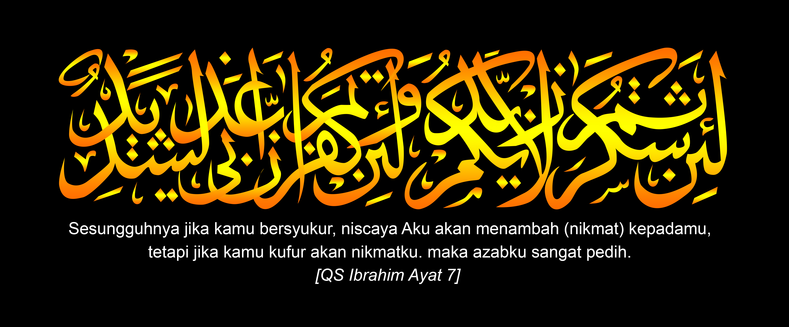

# Materi 5 - Memahami Rejeki, Ajal, Jodoh, dan Takdir.

<figure><figcaption>
Ayat tentang bersyukur.
</figcaption></figure>

Pada pembahasan sebelum nya kita telah mengurai apa itu iman, islam dan ihsan, lalu mengurai apa yang menjadi hijab hijab hati dan membersihkan nya dengan jalan pertaubatan, lalu kita belajar mengenal Allah dengan pembahasan mengenai sifat sifat nya yaitu Nafsiah, Salbiah, Ma’ani, dan Ma’nawiah hingga kita mulai memahami dan mengenal diri sebagai makhluk ciptaan Nya, yang mana dalam setiap penciptaan makhluk nya Allah pasti menjamin, mencukupi, serta mangatur Rejeki, Ajal, Jodoh, dan Takdir nya.

dan ke 4 hal di atas disebut dengan 4 perkara yang akan menjadi ujian dalam fase perjalanan manusia di alam dunia dengan berbekal pemahaman dari pembahasan sebebelum nya yang mana di sana membahas tentang 7 lapisan hati yang terdiri dari ruh beserta hawa nafsu nya, yang mana dari ke 7 lapisan tersebut hanya 4 yang wajib kita tauhid kan dalam fase syariat dan fase tarikat, karena untuk yang 3 lapis selanjut nya itu adalah fase perjalanan hakikat.

Berarti, semua manusia berkesempatan dan berkemampuan untuk mentauhidkan ke 4 lapis hati nya dengan bekal dari uraian pembahasan pembahasan tersebut.

Maka pada pembahasan kali ini, kita akan belajar memahami bagai mana skenario Allah mengatur dan menguji kita dengan 4 perkara yaitu: Rejeki, Ajal, Jodoh dan Takdir setiap makhluk nya. Dalam kehidupan seluruh manusia di alam dunia dalam 24 jam aktifitas sehari hari nya, tidak ada satupun yang keluar dari ujian rejeki, ajal, jodoh, dan takdir. dan melalui tulisan dalam pembahasan ini, kita akan mengurai pemahaman pemahaman tentang ujian 4 perkara tersebut yang mudah mudahan ini membuka cakrawala berfikir kita dalam menyikapinya agar menuntun kita pada lulus nya menghadapi ujain tersebut. dalam arti lulus nya itu bagai mana, dengan cara apa, dan ciri kita lulus nya seperti apa?

Dalam pembahasan sifat 20 manawiah  sebelum nya, disana di jelaskan bahwa Allah menitipkan sifat Qadiran dalam diri manusia, sehingga dengan adanya sifat tersebut manusia jadi memiliki kuasa atas diri nya. lalu cahaya Qadiran tersebut menyinari Ruh Hewani, dan ruh hewani tersebut membangkitkan nafsu yang di sebut dengan nafsu Amarah.

Dan ujian yang pertama, Allah memberikan ujian pada lapisan hati yang pertama yaitu ruh hewani dengan nafsu nya yaitu nafsu amarah yang di uji dengan perkara rejeki. jika kita ingin mengerti seperti apa itu ruh hewani, maka kita lihat bagai mana hidup binatang. yang mana dalam hidup nya hanya memiliki nafsu amarah, dan tidak memiliki nafsu lawamah, mulhimah apa lagi mutmainah.

jadi, binatang itu hanya memiliki nafsu Amarah, dan juga tidak memiliki akal. maka dari itu, binatang tidak memiliki rasa takut, tapi hanya memiliki keinginan.

Contoh: kita mengusir Ayam yang berada di halaman rumah, kita usir, datang lagi, di usir, datang lagi karena tidak ada rasa takut dalam diri binatang. andaikan ayam tersebut pun pergi bukan berarti takut, namun karena tidak ingin merasakan sakit, karena biasanya jika ayam terus membandel, ada kala nya kita lempar dengan sesuatu agar ayam tersebut pergi. dan jika kita nya sudah masuk ke rumah ayam tersebut pun akan datang lagi, karena tahu di sekitaran halaman ada makanan yang bisa dia cari dan dapatkan di sana.

Nah seperti itulah gambaran ruh Hewani, yang mana yang di ikuti nya hanya sekedar keinginan. nah Amarah ini di uji oleh perkara rejeki, sedangkan lawamah di uji oleh perkara ajal. jika rejeki itu kita maknai adalah segala sesuatu yang di anugerahkan oleh Allah, maka ajal adalah batas waktu.

Rejeki, jika kita pahami secara luas yaitu langit bumi, dan segala isi nya itu di ciptakan Allah untuk manusia, berarti itu adalah rejeki. lalu ada laut ada gunung dan semua ekosistem nya di ciptakan Allah untuk manusia, maka itu pun adalah rejeki. kemudian ada binatang, ada tumbuhan yang diciptakan Allah untuk manusia, maka itu pun adalah rejeki. hingga ada makanan, ada tempat tinggal yang Allah ciptakan untuk manusia dan itupun adalah rejeki. selanjut nya ada orang tua, ada anak, ada istri dan itu pun merupakan rejeki.

selanjut nya kita membaca diri, ada tangan, ada kaki, ada mata, ada hidung, ada telinga yang kesemua itu Allah ciptakan untuk manusia berarti itu pun adalah rejeki.

nah dalam hal ini berarti ujian pertama yang adalah, segala sesuatu hal, yang Allah limpahkan kepada manusia itu jadi ujian untuk Amarah.

Nah semua rejeki tersebut, ada Ajal nya. atau jika lebih spesifik lagi, rejeki tersebut memiliki batas waktu. maka dari itu ada ungkapan, segala sesuatu yang ada di alam dunia, pasti ujung nya adalah habis dan rusak. mengapa demikian? ya karena segala rejeki yang ada di alam dunia ada batas waktu nya.

mulai dari langit dan bumi, ada batas waktu nya, kemudian laut dan gunung, ada batas waktu nya. kemudian orang tua, istri dan anak, ada batas waktu nya. hingga hidup seluruh manusia pun, ada batas waktu nya. dan itu lah yang di sebut Ajal.

Rejeki yang memiliki batas waktu tersebut, wajib kita ikhtiarkan. yang mana ikhtiar tersebut harus bertemu dengan perkara jodoh.

Rejeki yang di ikhtiarkan hingga bertemu dengan perkara jodoh, akan menjadi Takdir. dan inilah 4 perkara yang dijadikan Allah untuk ujian dalam hidup manusia.

Lalu, bagai manakah kita memahami seluk beluk ujian dalam urusan rejeki tersebut?

Yang pertama, Allah memberikan rejeki untuk semua makhluk nya adalah supaya kebidupan terus berlangsung, maka di butuhkan lah rejeki sebagai penunjang nya. dan Allah memberitahukan kita tentang jaminan rejeki untuk semua makhluk nya dalah Quran surah Hud ayang te 6 berikut ini:

Wa mā min dābbatin fil-arḍi illā ‘alallāhi rizquhā wa ya’lamu mustaqarrahā wa mustauda’ahā, kullun fī kitābim mubīn.

Artinya: “Dan tidak satupun makhluk bergerak (bernyawa) di bumi melainkan semuanya dijamin Allah rezekinya. Dia mengetahui tempat kediamannya dan tempat penyimpanannya. Semua (tertulis) dalam Kitab yang nyata (Lauh Mahfuzh).”

Dalam penggalan ayat tersebut Allah memberitahukan kita bahwa tidak ada satupun makhluk di alam dunia ini, kecuali Allah jamin rejeki nya. jadi semua makhluk yang di ciptakan Allah, maka Allah bertanggung jawab untuk memberikan rejeki nya agar kehidupan nya terus berjalan. baik binatang, maupun tumbuhan Allah bertanggung jawab untuk kehidupan nya. jika tumbuhan Allah berikan rejeki berupa Air yang di turunkan dari langit, lalu sinar matahari yang Allah pancarkan untuk nya, hingga unsur unsur hara yang berada di alam tanah.

Dimulai dari pohon yang ditanam di kebun, tanaman yang kita tanam di dalam pot, hingga pohon yang hidup di hutan belantara sekalipun, semua nya Allah jamin rejeki nya agar hidup nya terus berlangsung.

lalu mulai dari binatang yang kita pelihara di kandang, hingga binatang yang hidup di alam liar yang tak pernah bertemu dengan manusia pun Allah jamin rejeki nya.

lalu ada bangsa jin, manusia, dan apapun itu makkluk yang di ciptakan nya, Allah tanggung jawab terhadap rejeki nya.

jadi keperluan rejeki tersebut adalah untuk penunjang hidup, karena saat makluk sudah mati, maka tidak lagi membutuh kan rejeki.

lalu selanjut nya, apa sajakah yang bisa kita kategorikan sebagai rejeki untuk keperluan hidup?

Jika kita sederhanakan, keperluan rejeki untuk hidup secara hakikat nya hanyalah 3 (tiga). yang pertama yaitu makanan, yang kedua yaitu pakaian, dan yang ke tiga adalah tempat tinggal. dan itulah  rejeki yang paling pokok yang di butuhkan.

dan kita semua pun telah membuktikan bahwa rejeki untuk hidup,  Allah bertanggung jawab. yang menjadi ciri nya adalah ketiga kebutuan pokok tersebut tak pernah tidak kita temukan dalam kehidupan kita.

mulai dari makanan, yang dari semenjak kita lahir hingga hari ini, masih kita dapatkan. lalu pakaian, yang sampai hari ini detik ini pun kita masih memakai nya. dan yang ke tiga adalah tempat tinggal, yang sampai hari ini detik ini kita pun masih mendapatkan nya.

adapun tempat tinggal tersebut hasil membeli, masih mengontrak, kita menumpang, atau pun membangun sendiri, secara hakikat nya itu adalah rejeki dari Allah.

dan ini menjadi bukti nyata bahwa ketiga hal tersebut selalu Allah penuhi untuk kebutuhan hidup kita.

nah yang jadi ujian nya adalah Amarah, yang mana jika hidup kita tidak selalu mengikuti Amarah, sesungguh nya hidup kita baik baik saja. yang dalam arti makanan, pakaian, dan tempat tinggal selalu ada untuk kita. dari zaman nabi adam pun ketiga hal tersebut allah penuhi.

jika pada saat jaman nabi adam makanan nya berupa buah buahan, atau daging hasil berburu, pakaian nya dari daun daunan, tempat tinggal nya dari rumah sederhana yang prinsipnya semua berasal dari Allah. hingga berkembang hari ini segala rupa makanan, lalu segala rupa pakaian, dan segala bentuk tempat tinggal yang jelas 3 perkara tersebut terbukti oleh manusia sealam dunia bahwa apa yang di tuliskan dalam Quran Allah bertanggung jawab untuk rejeki setiap makhluk nya.

Lalu sekarang, mengapa ketiga hal tentang rejeki tersebut terasa menjadi masalah?

jawaban nya adalah karena kita hidup mengikuti Amarah, mulai lah bermasalah.

yang dalam arti seandai nya untuk perkara rejeki kita tidak mengikuti keinginan nafsu, sesungguh nya kita tidak memiliki masalah dan baik baik saja.

karena yang jadi akar masalah tersebut adalah ketika standar rejeki yang kita dapat kan mengikuti nafsu Amarah. mari kita perjelas pembahasan nya.

mulai dari makanan, yang di maksud dengan makanan, keperluan nya adalah agar kita punya tenaga untuk hidup, maka dalam hal ini yang kita butuhkan secara esensi dari makanan adalah kalori nya.

jadi setiap hari manusia butuh berapa kalori agar tenaga hidup nya tercukupi.

Adapun kalori tersebut bisa di hasilkan dari umbi, dari singkong, dari jagung bukan masalah, karena yang di butuhkan adalah kalori nya.

dan dalam hal ini, manusia di alam dunia dalam urusan kebutuhan makanan, sama. yaitu dengan hitungan sekian kalori dan kalau pun berbeda kebutuhan kalori nya tidak akan terlalu jauh.

baik itu orang eropa, orang amerika, orang asia, dan orang di belahan dunia manapun keperluan kalori nya rata rata sama.

nah ketika standar makanan tersebut mengikuti nafsu Amarah, mulai lah bermasalah, dan yang jadi patokan nya bukan lah kebutuhan lagi.

sehingga ukuran standar makanan tersebut menjadi keinginan selera nya.

contoh: yang ada di meja makan adalah nasi hangat dengan tahu atau tempe, tapi apa yang di inginkan nya bukan lah itu jadi lah nasi dan tempe tersebut di masalahkan.

mengapa bisa jadi masalah?

karena dalam akal nya tersimpan sekian banyak bermacam macam jenis jenis makanan. pernah melihat masakan padang, pernah melihat masakan sunda, pernah melihat masakan asia, eropa, amerika dan sebagai nya yang mana data dari apa yang dia lihat tersebut mendorong nafsu keinginan nya.

semakin banyak pengetahuan tentang makanan,semakin besar pula dorongan keinginan mencoba makanan tersebut.

seandai nya data dalam akal nya tidak tersimpan bermacam macam jenis makanan,maka dorongan keinginan nya pun tidak akan terlalu besar.

jika kita bertafakur kebelakang tentang hal ini, jika Nabi Adam ingin memakan makanan enak, tentu tidak terbayang yang aneh aneh, ya paling ke hutan membawa panah dan berburu kijang.

itu pun jika sekali waktu ingin makan makanan yang enak.

mengapa begitu? karena data dalam Akal nabi adam tidak ada Nasi padang, tidak ada martabak telor, tidak ada rumah makan Ampera.

yang ada dalam akal nabi adam tentu nya buah buahan, daun daunan, binatang buruan. sehingga saat ingin makan makanan enak ya tentu yang enak untuk ukuran apa yang ada dalam akal nya.

jika kita hari ini ingin makan makanan enak sebegitu banyak nya pilihan makanan enak menurut akal kita, sehingga ketika dalam realita nya hanya ada nasi hangat dengan tahu atau tempe kita jadi merasa masalah.

Padahal, dengan nasi hangat dan tahu tersebut menghasilkan kalori yang bisa menjadi tenaga untuk hidup. namun duduk perkara nya adalah ketika kenyataan bentrok dengan data yang ada di dalam akal, jadi lah kenyataan tersebut terasa menyiksa.

dan sesungguh nya yang menyiksa bukan lah kenyataan, tapi data dari akal yang di dorong oleh nafsu keinginan. mulailah menghadapi nasi hangat dan tahu tersebut merasa di dzolimi oleh takdir.

Padahal, menciptakan beras 2 butir pun kita tidak lah bisa. yang akhir nya hal tersebut menjauhkan kita dari rasa bersyukur. Dan Allah memberitahukan kita tentang hal ini dalam surah Ibrahim ayat ke 7 berikut ini:

Wa iż ta’ażżana rabbukum la’in syakartum la’azīdannakum wa la’in kafartum inna ‘ażābī lasyadīd(un).

Artinya: (Ingatlah) ketika Tuhanmu memaklumkan, “Sesungguhnya jika kamu bersyukur, niscaya Aku akan menambah (nikmat) kepadamu, tetapi jika kamu mengingkari (nikmat-Ku), sesungguhnya azab-Ku benar-benar sangat keras.”

Ayat tersebut menjelaskan bahwa nikmat yang sesungguh nya adalah ketika kita berhasil mensyukuri segala sesuatu yang Allah anugerahkan kepada kita maka hal tersebut akan mendatangkan rasa nikmat.

Namun jika kita mengkufuri, dalam arti tidak menerima kenyataan yang Allah berikan kepada kita, Apapun akan menjadi masalah yang menyiksa.

Jangankan nasi hangat dengan tahu, kadang nasi padang lauk rendang pun jadi masalah jika kita tidak berhasil mensyukuri nya.

Lalu selanjut nya yaitu pakaian, yang di maksud dengan pakaian secara hakikat nya adalah untuk menutup aurat. dan Allah memberi tahu kita tentang ini dalam ayat Quran surah Al’Araf ayat ke 26 berikut ini:&#x20;

Yā banī ādama qad anzalnā ‘alaikum libāsay yuwārī sau’ātikum wa rīsyā(n), wa libāsut-taqwā żālika khair(un), żālika min āyātillāhi la‘allahum yażżakkarūn(a).

Artinya: Wahai anak cucu Adam, sungguh Kami telah menurunkan kepadamu pakaian untuk menutupi auratmu dan bulu (sebagai bahan pakaian untuk menghias diri). (Akan tetapi,) pakaian takwa itulah yang paling baik. Yang demikian itu merupakan sebagian tanda-tanda (kekuasaan) Allah agar mereka selalu ingat.

Yang mana ketika Nabi Adam dan siti hawa di turunkan ke alam dunia dalam keadaan tanpa penutup aurat, hal yang pertama mereka cari saat itu adalah pakaian, yang saat itu terbuat dari daun daunan dan kulit kayu. saat itu mereka berusaha bagai mana cara nya agar aurat nya tertutup. Dan jika kita pegang teguh esensi dari pakaian, maka hingga hari ini pun tidak akan menjadi masalah.

yang bahkan ketika kita lahir ke alam dunia pun, hal yang pertama kita dapatkan adalah kain untuk menutupi aurat. dan hari ini apa yang menjadi masalah dalam kehidupan kita tentang pakaian ini?

akar permasalahan nya tetaplah sama, yaitu ketika standarisari dalam pakaian, kita mengikuti nafsu Amarah.

hingga hari ini ada Mode, ada pakaian branded (bermerk), dan sebagai nya yang berkaitan dengan pakaian. yang mana jika tidak terpenuhi pun akan menjadi masalah.

yang oleh akal manusia saat ini dengan penglihatan dan pendengaran nya yang di dorong oleh keinginan, perkara tentang pakaian pun jadi di utak atik.

jadi ada baju untuk kondangan, baju untuk olah raga, baju untuk ke mesjid, baju untuk tidur, baju untuk santai, di beda beda.

oleh siapa? ya oleh manusia!

Padahal kalau menurut saya, Main bola pakai Batik, ya tidak masalah karena esensi nya hanya untuk menutup aurat.

namun karena standarisasi manusia tentang pakaian olah raga, hingga akhir nya main bola pakai batik jadi masalah.

padahal tidak ada yang menghalangi, namun kehidupan kita menyatakan hal itu adalah masalah besar.

yang padahal kalau kita telaah, yang ahli dalam main bola nya ya tetaplah bermain bagus dengan pakaian batik sekalipun. tidak berubah gara gara pakai batik main bola nya jadi jelek! nah ini lah standarisasi amarah yang secara tidak di sadari jadi memenjarakan kita.

yang hingga puncak puncak nya jika satu saat kita di undang ke sebuah acara, lalu kita tidak punya baju “yang bagus” menurut amarah kita, hingga jadi batal untuk datang. yang jika kita pahami hal ini ya esensi dari pakaian adalah untuk menutup aurat, bukan yang lain.

lalu yang ketiga, yaitu tempat tinggal. lalu apa esensi tempat tinggal? sederhana nya yaitu agar tidak kepanasan dan juga tidak kehujanan. ada pun tempat itu mengontrak, menumpang, membeli, ataupun membangun sendiri bukan lah masalah.

karena baik menyewa rejeki nya dari Allah, menumpang rejeki nya dari Allah, membeli rejeki nya dari Allah, dan  membangun sendiri pun rejekinya ya dari Allah.

Apakah ada yang bisa memberi rejeki selain Allah? ya tidak ada.

dan dalam hal ini pun ketika yang mensikapi nya adalah amarah, mulai lah jadi masalah. misalkan ada orang yang meninggal, lalu digunjing oleh tetangga nya “dia meningal nya di rumah kontrakan”

yang dalam hal ini seolah olah meninggal di tempat kontrakan itu suatu masalah dan terkesan negatif.

hingga akhir nya masyarakat beranggapan bahwa meninggal yang baik itu di rumah hasil membangun sendiri. padahal tidak ada ketentuan dari Allah yang menerangkan bahwa meninggal yang bagus itu adalah di rumah sendiri.

dan dalam hal ini perkara tempat tinggal pun diutak atik, jadi ada ruang tamu, ruang tidur, ruang makan, ruang privasi, ruang hobi, dan sebagainya. hinga ada istilah interior, exterior, yang makin ke sini ada standar rumah dengan kolam renang, ruang gym dan sebagai nya yang di buat oleh standar manusia.

yang puncak puncak nya jika kita masih tinggal di rumah yang masih mengontrak itu menjadi susah untuk bersyukur, yang mana jadi ada tradisi ketika kita syukuran itu saat kita sudah bisa punya rumah dari membangun sendiri dan bangunan nya pun terlihat “bagus” menurut akal nya.

padahal jika kita bertafakur dan memaknai standar syukur, jika saat seseorang memiliki uang miliaran dan triliunan lalu bersyukur,ooh itu hal yang lumrah dan sangat sangat biasa.

karena yang luar biasa nya adalah ketika dalam dompet hanya ada uang sepuluh ribu lalu berterima kasih hingga meneteskan air mata sebagai tanda syukur kepada Allah.

nah standar syukur ini lah yang semakin ke sini semakin di tekan yang akhir nya kualitas akhlak manusia saat ini semakin rendah.

Selanjut nya, rejeki yang telah di jelaskan di atas tersebut, status nya adalah amanah. yang dalam arti amanah tersebut adalah titipan. dalam hal ini kita sedang membahas itikad (keimanan), karena secara syariat ada hak milik menurut hukum fiqih, namun jika kita melihat dengan sudut pandang keimanan jangan ada pendirian rejeki tersebut adalah hak milik.

karena dalam hakikat nya, segala rupa apapun itu rejeki yang di anugerahkan kepada manusia status nya adalah amanah yang dalam arti sebagai titipan atau hak guna pakai jika di artikan secara gamblang nya.

jadi tidak ada hakikat rejeki yang status nya adalah hak milik, jangan kan sawah, kebun dan rumah, anak istri pun status nya adalah amanah (hak guna pakai) yang mana ketika oleh Allah di ambil kembali ya kita tidak bisa menawar.

jangan kan makanan, harta benda bahkan jasad yang kita bawa sehari hari pun sama yaitu adalah hak guna pakai yang ketika jangka waktu yang telah di tentukan nya habis kita pun akan meninggalkan nya.

maka dari itu, tidak ada satupun rejeki dari Allah yang status nya adalah hak milik, baik itu kendaraan, pakaian, tempat tinggal, anak istri dan apapun itu yang ada dalam kehidupan kita semua nya adalah titipan (hak guna pakai).

Jika rejeki untuk hidup, semua manusia sealam dunia sama. jika untuk makanan, manusia sealam dunia hakikat nya adalah kalori, jika untuk pakaian manusia sealam dunia hakikat nya adalah menutup aurat, jika tempat tinggal manusia sealam dunia  hakikat nya adalah berteduh dari panas dan hujan. maka semua hal tersebut adalah sama.

namun untuk rejeki yang di titipkan, dalam hal ini berbeda beda dalam arti ada yang Allah titipkan banyak, ada yang Allah titipkan sedikit. ada yang Allah titipkan besar ada yang Allah titipkan kecil. yang dalam hal ini sengaja Allah beda bedakan dengan tujuan agar ada kehidupan.

jadi ada yang bekerja ada yang membayar, ada yang mengajar ada yang belajar, ada yang sakit ada yang mengobati sehingga ada kehidupan yang berjalan.

jika tidak seperti itu, maka kehidupan tidak akan berjalan.

Jika semua manusia rejeki nya banyak semua ingin membuka lapangan pekerjaan, lalu siapa yang akan bekerja?

jika semua manusia rejeki nya sedikit, semua ingin bekerja, lalu siapa yang akan membayar?

yang rejeki nya besar amanah nya membayar, yang rejeki nya sedikit amanah nya di bayar. maka dari itu besar amanah, kecil pun amanah.

lalu yang di beri ilmu yang banyak, amanah nya mengajar, yang di beri ilmu sedikit, amanah nya belajar.

Ilmu yang banyak amanah, ilmu yang sedikit pun amanah.

Yang amanah nya kecil tidak akan menjadi besar, yang amanah nya besar pun tidak akan menjadi kecil. yang takdir rejeki nya banyak tidak akan menjadi sedikit, yang takdir rejeki nya sedikit pun tidak akan menjadi banyak.

pertanyaan nya mengapa di beda bedakan?

yang pertama supaya ada kehidupan, dan yang ke dua dibeda bedakan oleh keadilan. dan yang di maksud dengan adil di sini yaitu bukan lah sama rata dan juga bukan sama besar nya.

begini alanogi beserta contoh nya:

Allah menciptakan pohon tomat yang ajal nya hanya sampai 4 bulan, lalu Allah sesuaikan lah bentuk akar bentuk dahan dan bentuk daun nya sedemikian rupa agar sesuai dengan takdir nya.

lalu Allah menciptakan pohon singkong yang ajal nya 1 tahun, kemudian Allah sesuaikan lah bentuk akar, bentuk batang, dan bentuk daun nya agar sesuai dengan takdir nya.

lalu ada juga pohon albasia yang ajal nya puluhan tahun, kemudian Allah sesuaikan lah bentuk akar, bentuk batang, dan bentuk daun nya agar sesuai dengan takdir nya.

dan yang selanjut nya yaitu pohon jati, yang ajal nya bisa puluhan bahkan sampai ratusan tahun, Allah sesuaikan lah bentuk akar, bentuk batang dan bentuk daun nya agar sesuai dengan takdir nya.

lalu Allah turunkan lah rejeki untuk semua pohon tersebut dari langit yang berupa air hujan dan cahaya matahari. yang mana pohon tomat bisa menyerap air hujan dan sinar matahari sesuai dengan kebutuhan nya yang cukup untuk sampai 4 bulan, lalu pohon singkong yang menyerap air dan cahaya matahari sesuai kebutuhan nya untuk selama 1 tahun, lalu pohon albasia yang mampu menyerap air dan cahaya matahari sesuai kebutuhan nya hingga sekian puluh tahun, dan terakhir pohon jati yang bisa menyerap air dan cahaya matahari sesuai kebutuhan nya hingga puluhan bahkan ratusan tahun.

nah itu lah yang di maksud dengan adil dalam hal ini. rejeki untuk tomat sesuai dengan garis hidup nya, rejeki pohon singkong juga sesuai dengan garis hidup nya, begitupun untuk pohon albasia dan pohon jati yang sesuai dengan garis hidup nya.

dan dalam hal ini jika rejeki untuk pohon jati lalu di berikan untuk pohon tomat bukan malah menjadi bagus, misalkan air untuk pohon jati yang sebegitu banyak nya di berikan untuk pohon tomat, yang ada malah membusuk pohon tomat tersebut.  begitu pun jika cahaya matahari untuk pohon jati di berikan untuk pohon tomat yang terjadi maka akan mengering dan akhir nya mati.

maka dalam hal ini adil itu bukan lah sama rata dan sama besar, tapi sesuai dengan kebutuhan nya.

analogi tersebut menggambarkan apakah kita hidup bisa selamat dengan di beri rejeki yang banyak atau hidup kita selamat dengan rejeki yang sedikit, Allah maha mengetahui. dan hal ini lah yang sering kali tidak di pahami, memang tidak ada manusia yang ingin hidup nya berkekurangan, semua manusia ingin menjadi kaya, namun duduk perkara nya dengan menjadi kaya belum tentu mengantarkan kita pada keselamatan.

dan seandai nya kita sering bertafakur dalam hal ini dan boleh memilih ujian, ada kala nya lebih baik hidup berkekurangan.

mengapa?

karena dengan keadaan tersebut kita sering kali selalu mengingat Allah, tiap beribadah memohon pertolongan, tiap beribadah meminta di lancarkan rejeki nya, tiap waktu selalu mengingat Allah.

namun saat kita dalam kondisi kaya dan segala berkecukupan sering kali kita menjadi takabur dan lupa bersyukur kepada Allah.

ketika kita dalam keadaan serba susah sangat terasa betapa hinanya diri kita ini,  betapa lemah nya diri kita ini, betapa kotor nya diri kita ini akan dosa dosa yang pernah di perbuat.

namun ketika kita Allah uji dengan kekayaan, merasa diri paling bersih, merasa diri paling di ridhoi, merasa diri paling mulia di hadapan Allah.

Bahkan dalam satu riwayat di ceritakan bahwa Rasulullah pernah berdo’a meminta kepada Allah agar hidup miskin.

Diantara sekian banyak do’a-do’a yang Nabi Shallallahu ‘alaihi wa sallam ajarkan kepada umatnya adalah do’a dibawah ini :

“Allahumma ahyinii miskiinan, wa amitnii miskiinan, wahsyurnii fii jumratil masaakiin”.

“Artinya : Ya Allah ! Hidupkanlah aku dalam keadaan miskin, dan matikanlah aku dalam keadaan miskin, dan kumpulkanlah aku (pada hari kiamat) dalam rombongan orang-orang miskin”.

Hadits ini dikeluarkan oleh Imam Ibnu Majah (no. 4126) dan lain-lain. Al-Albani mengatakan bahwa hadits ini derajatnya : hasan. \[Lihat pembahasannya di kitab beliau : Irwaul Ghalil (no. 861) dan Silsilah Shahihah (no. 308)]

Referensi : [Penjelasan tentang do’a nabi](https://almanhaj.or.id/2299-salah-faham-terhadap-doa-nabi-shallallahu-alaihi-wa-sallam.html)

mengapa demikian? karena terasa nikmat dalam keadaan tersebut tidak pernah lupa kepada Allah.

namun dalam hal ini, karena kita tidak bisa memilih bentuk ujian maka dari itu  baik di beri kemiskinan ataupun diberi kekayaan kita harus bisa menyikapi nya.

dan sekarang duduk perkara nya, mengapa kita begitu sangat sulit untuk menerima rejeki yang di amanahkan ini?

dan mengapa rata rata tidak ingin di uji dengan kesengsaraan, dan semua nya ingin hidup menjadi kaya?

karena ada campur tangan manusia yang merusak penatataan rejeki.

yang mana dalam penataan rejeki secara hakikat nya Allah membedakan rejeki karena ada amanah dan tanggung jawab.

yang amanah nya banyak, rejeki nya pasti banyak, begitupun dengan tanggung jawab yang besar Allah memberikan rejeki yang besar pula.

lalu yang amanah nya sedikit ya rejeki nya sedikit, yang tanggung jawab nya besar Allah memberikan rejeki yang besar pula.&#x20;

contoh: orang yang memiliki 2 orang anak, pasti Allah memberikan rejeki yang cukup untuk 2 orang anak tersebut sesuai dengan amanah dan tanggung jawabnya.

lalu ada orang yang memiliki 7 orang anak, pasti Allah pun memberikan rejeki yang cukup untuk 7 orang anak tersebut sesuai dengan amanah dan tanggung jawab nya.

dan itu lah penataan rejeki secara Hakikat yang Allah sesuaikan dengan amanah dan tanggung jawab nya.

Lalu, ada rejeki yang di amanah kan untuk di berikan kepada rakyat banyak yang Allah titipkan kepada seorang raja.  dan rejeki ini di sebut dengan Rizqon Mamluk. yaitu amanah rejeki yang Allah titipkan dengan tanggung jawab yang besar pula. anak raja pasti akan menjadi raja, karena ini berbicara genetis. Dan dalam kenyataannya pun itu berjalan seperti itu.&#x20;

Sedangkan anak presiden belum tentu menjadi presiden.&#x20;

dan sekarang penataan tersebut telah di rusak oleh tata aturan yang di ciptakan oleh manusia yang di awali dengan penciptaan uang kertas.

Pada zaman dahulu standard uang adalah emas dan perak seperti yang kita ketahui ada uang Gulden, Poundsterling, Dinar dan juga Dirham. bahkan mata uang Indonesia pun pada zaman dahulu adalah emas dan perak yang salah satu nya di sebut dengan mata uang Krishnala dan mata uang Syailendra. namun saat ini penataan mata uang sudah tidak bergantung lagi kepada emas dan perak semenjak ada nya uang kertas.

sejarah uang kertas di awali ketika bangsa Romawi menjajah bangsa Yahudi, yang mana dalam sejarah agama samawi ada ajaran untuk memelihara keimanan dengan cara berderma atau kita mengenal nya saat ini dengan Zakat, Infak dan Sedekah. dan pada saat itu ada sebuah tempat ibadah yang di sebut “Bait Allah” yang di kelola oleh para pendeta dari bangsa Yahudi, dan pada saat setiap Orang romawi yang ingin berziarah ke “Bait Allah” tersebut lalu ingin dan ingin beramal dengan harta benda nya pada pada saat itu para pendeta yahudi hanya mau menerima koin emas dan perak yang di keluarkan oleh para pengelola “Bait Allah” tersebut.

Sehingga pada saat orang orang ingin beramal untuk “Bait Allah” tersebut harus di tukarkan dahulu koin emas dan perak yang mereka bawa dengan koin emas dan perak yang di keluarkan oleh pihak pengelola tersebut. namun jumlah emas dan perak tersebut tidak setara nilai nya dengan koin emas dan perak yang di tukarkan dari bangsa Romawi.

Misalkan 1 keping koin Orang romawi memiliki kandungan emas 20 Gram, sedangkan 1 keping koin dari keluaran pengelola “Bait Allah” Yahudi memiliki kandungan emas 10 Gram, maka dari setiap transaksi penukaran tersebut pihak pendeta memiliki keuntungan 10 Gram emas dari tiap keping koin nya. dan transaksi penukaran itu di laksanakan di depan tempat tersebut dengan menggunakan lapak lapak di atas meja.

Dan hal ini di kisahkan dalam kitab injil, ketika nabi isa mengunjungi “Bait Allah” tersebut marah dan mengguling-gulingkan meja dan bangku yang ada di sana dan berikut ini beberapa referensi yang saya dapatkan mengenai kisah ini:

Referensi 1 : [ini alasan Nabi Isa marah di bait allah](https://www.tempusdei.id/2021/03/4462/ini-alasan-yesus-marah-di-bait-allah.php)

Referensi 2 : [Nabi Isa marah di bait allah](https://www.hidupkatolik.com/2019/09/04/39504/marah-di-bait-allah.php)

Referensi 3 : [Nabi Isa menyucikan bait Allah](https://www.bible.com/id/bible/306/MAT.21.TB)

Dan berawal dari tukar menukar mata uang ini lah yang menjadi cikal bakal tercipta nya Bank, yang mana pada saat itu proses tukar menukar koin emas dan perak di rasa menjadi tidak efektif dan rawan tindakan kejahatan, sehingga munculah ide dari para pendeta yahudi tersebut untuk membangun sebuah tempat untuk menampung koin koin emas dan perak yang ingin di tukarkan atau di simpan di sana. dan sebagai bukti kepemilikan nya dikeluarkan lah nota berupa catatan di atas kertas yang menjelaskan nilai kepemilikan emas dan perak tersebut bagi yang menyimpan nya.

Pada awal mula nya saat sang pemilik emas tersebut ingin mengambil emas nya, mereka harus menukar nota kertas itu terlebih dahulu ke tempat penyimpanan tersebut lalu di keluarkan lah emas sesuai dengan yang tertera pada nota kertas itu lalu bisa melakukan transaksi jual beli dengan emas nya. karena pada saat itu setiap nota yang di keluarkan memiliki nilai yang sama dengan jumlah emas yang tersimpan di tempat para pendeta yahudi tersebut.

dan semakin lama seiring berjalannya waktu, proses itu pun dirasa kembali tidak efektif hingga akhir nya transaksi cukup berjalan dengan menukar nukar nota kertas tersebut karena nilai kertas tersebut memiliki nilai yang sama kuat nya dengan emas yang tersimpan di tempat para pendeta yahudi.

kahidupan manusia pun terus berkembang dan seiring berjalan nya waktu hingga pada satu masa terjadilah manipulasi antara jumlah emas yang tersimpan dengan nota kertas yang beredar di masyarakat sudah tidak sesuai dengan nilai emas nya. hingga akhir nya pada saat ini, nilai uang kertas sudah tidak tergantung lagi kepada nilai emas yang menjadi tolak ukur nya sehingga uang kertas yang kita kenal saat ini sudah kehilangan “Nyawa” nya!

dan ini lah yang menjadi cikal bakal rusak nya tatanan rejeki. karena orang orang yahudi tersebut, tanpa memiliki emas pun mereka bisa dengan leluasa mencetak uang kertas sesuai kehendak mereka untuk memanipulasi tatanan ekonomi demi keuntungan mereka.

dan hal ini terus berlanjut hingga kehidupan kita saat ini, tanpa kita sadari bahwa tatanan hakikat rejeki sudah dirusak oleh ada nya uang kertas yang saat ini di gunakan oleh hampir semua negara di dunia dengan adanya Bank di setiap negara. yang mana nilai mata uang antara satu negara dengan negara yang lain pun tidak lah selalu sama, sehingga mulai lah terjadi kesenjangan ekonomi antar negara negara di dunia saat ini.

Yang mana saat ini suatu negara yang memiliki kemajuan ekonomi yang pesat dan menjadi negara adi kuasa dan mereka lah yang mengatur perekonomian dunia dengan mengatur komoditas utama bagi kebutuhan hidup manusia di antara salah satu nya adalah perdagangan minyak.

yang mana kita ketahui harga minyak sangat bergantung kepada mata uang Dollar, sehingga pembelian minyak dilakukan dengan menggunakan mata uang Dollar yang saat ini kita kenal dengan istilah “Petro Dollar”.

Maka dalam hal ini setiap negara yang ingin membeli minyak harus menukarkan dahulu mata uang nya kedalam mata uang Dollar, dan harga satu Dollar untuk setiap penukaran mata uang pun merekalah yang menentukan nya, dan ini lah yang menjadi kesenjangan nilai mata uang antar negara yang tentu saja berimbas juga kepada tatanan ekonomi nya. sehingga ada klasifikasi negara maju, negara berkembang dan negara miskin!

inilah penjelasan singkat mengapa tatanan rejeki saat ini menjadi rusak dan berantakan, karena ada kelompok yang membawa kepentingan materialis dan kapitalis demi keuntungan mereka. dan ini telah menjadi penjajahan secara sistematis yang tanpa kita sadari yaitu penjajahan ekonomi.

Lalu, bagai manakah kita menyikapi perkara ini agar bisa kembali menata rejeki yang Allah tetap kan untuk kita sebagai hamba nya?

Dalam hal ini, kita harus belajar menyikapi setiap rejeki kita dengan niat dan ikhtiar untuk beribadah, bukan untuk mengikuti hawa nafsu Amarah yang menjadi tolak ukur nya, maka Allah akan menjamin rejeki yang telah di tetapkan tersebut mencukupi kebutuhan hidup kita.

Allah memberikan 5 jalan yang halal untuk kita berikhtiar dalam beribadah menjemput rejeki tersebut.

1. Ikhtiarkan rejeki tersebut dengan mengambil keuntungan dari hasil berdagang.
2. Ikhtiarkan rejeki tersebut dengan mendapatkan hasil dari upah bekerja.
3. Ikhtiarkan rejeki tersebut dengan meminjam, jika kita dalam keadaan belum berhasil dari 2 jalan di atas.
4. Ikhtiarkan rejeki tersebut dengan mensyukuri dari menerima pemberian.
5. Ikhtiarkan rejeki tersebut dengan jalan meminta (dalam hal ini bukan berarti menjadi pengemis), jika dari ke 4 jalan tersebut Allah belum membukakan pintu nya.

Di antara ke 5 jalan tersebut, ikhtiar paling mulia adalah hasil dari keuntungan berdagang, dan yang paling hina adalah hasil dari meminta. dalam hal ini, bukan berarti Allah menghinakan kita dengan ikhtiar meminta, namun hal itu adalah ujian bagi kita dalam menjemput rejeki yang Halal, dari pada kita mengambil nya dengan cara yang Dzalim atau Haram.

Kita bahas dari ikhtiar yang pertama yaitu dari keuntungan hasil berdagang.

Dalam hal ini pun, Allah telah memberikan ketetapan untuk setiap hambanya. untuk yang ketetapan rejeki nya besar maka Allah akan memberikan jalan rejeki dengan berdagang hal yang besar pula menurut ukuran kita dalam kehidupan sehari hari nya. seperti bisnis jual beli mobil dari mulai mobil sederhana sampai mobil mewah sesuai dengan klasifikasi nya. lalu ada yang berbisnis properti, dari mulai jual beli rumah sederhana hingga menjadi develover perumahan yang menjual apartemen sesuai dengan klasifikasi nya dan sebagai nya.

dan untuk yang rejeki nya kecil, maka Allah akan memberikan jalan rejeki dengan berdagang hal yang sederhana pula dalam kehidupan sehari hari nya. seperti berdagang sembako di warung rumahan, atau berjualan keliling yang kita kenal pedagang kaki lima, dan bisnis jual beli makanan ringan yang sederhana menurut ukuran kita.

namun dari kedua hal di atas tersebut di hadapan Allah adalah sama, yaitu kita menjemput rejeki dari hasil keuntungan berdagang! jangan sampai kita merasa berbangga diri apa lagi sampai sombong karena kita memiliki penghasilan besar dari besar nya usaha yang dimiliki, dan juga jangan sampai kita merasa rendah diri apa lagi sampai merasa hina karena kecil nya usaha yang kita miliki, karena secara hakikat nya Allah lah yang memberikan rejeki dari ikhtiar yang kita jalankan tersebut untuk mencukupi kebutuhan hidup.

Lalu yang ke dua, yaitu hasil dari upah bekerja.

Dalam hal ini pun berlaku ketetapan yang sama, untuk orang yang rejeki nya besar maka ia akan mendapatkan upah yang besar pula sesuai dengan amanah dan tanggung jawab dalam pekerjaan nya,seperti menjadi manager, atau pun pimpinan di sebuah perusahaan. Atau ada juga yang menjadi menteri dalam kabinet pemerintahan atau menjadi presiden suatu negara.

Dan untuk yang ketetapan rejeki nya kecil, maka ia akan mendapatkan upah yang kecil juga dari hasil bekerja nya, seperti menjadi buruh tani, buruh pabrik, cleaning service di sebuah perusahaan dan sebagai nya.

Hal ini pun di hadapan Allah adalah sama, kedua nya menjemput rejeki dari hasil upah bekerja untuk memenuhi kebutuhan hidup nya. yang berupah besar jangan sampai merasa mulia apa lagi sombong, yang berupah kecil pun jangan merasa rendah diri apa lagi merasa hina. karena secara hakikat nya Allah lah yang memberikan upah dari hasil ikhtiar pekerjaan nya.

Yang ke tiga yaitu ikhtiar dengan cara meminjam.

Dalam hal ini, Allah menguji ketakwaan hamba nya saat dua jalan di atas Allah tutup dengan berbagai asbab sehingga tidak mendapatkan hasil dari ikhtiar berdagang atau pun ketika tidak mendapatkan hasil dari ikhtiar upah kerja nya, maka kita ikhtiar kan menjemput rejeki dengan cara meminjam.

dan dalam hal ini jangan merasa rendah diri atau pun merasa malu karena kita meminjam rejeki dari orang lain selama pinjaman itu Halal dan tidak ada unsur riba, karena Allah dengan jelas dan tegas mengharamkan segala bentuk Riba yang di jelaskan dalam Quran surah Ali Imran Ayat ke 130 berikut ini:

“Yā ayyuhal-lażīna āmanū lā ta’kulur-ribā aḍ‘āfam muḍā‘afah(tan), wattaqullāha la‘allakum tufliḥūn(a).”

Artinya : Wahai orang-orang yang beriman, janganlah kamu memakan riba dengan berlipat ganda dan bertakwalah kepada Allah agar kamu beruntung.

yang wajib kita niat kan adalah mencari ridho Allah dalam proses ikhtiar nya, karena hakikat nya Allah pula lah yang membukakan kita pintu rejeki dari asbab meminjam tersebut.

Yang ke empat yaitu ikhtiar dengan mensyukuri dari menerima pemberian.

Ada kala nya Allah memberikan rejeki kepada kita melalui asbab pemberian dari orang lain, dan dalam hal ini kita harus berikhtiar mensyukuri nya karena dalam kehidupan sehari hari ada kala nya pula kita lupa bersyukur atas rejeki yang kita dapat kan. contoh nya ada tetangga yang memiliki makanan lebih lalu ingat kepada kita dan memberikan sebagian rejeki nya, atau contoh lain ada tetangga yang mengadakan syukuran khitanan anak nya lalu memberikan bingkisan untuk tetangga sekitar dan lain sebagai nya, itu pun adalah salah satu bentuk rejeki yang Allah datangkan dari asbab pemberian, yang mana jika kita tidak bisa mensyukuri nya maka kita termasuk dalam orang orang yang kufur nikmat. ada sebagian orang yang berpendirian tidak ingin hutang budi, sungkan dan malu jika di beri sesuatu oleh orang lain, padahal jika kita memaknai dengan ilmu rejeki, itu adalah salah satu asbab Allah datangkan rejeki untuk kita.

Yang ke lima yaitu ikhtiar dengan cara meminta.

Dalam ikhtiar yang kelima ini, ketika Allah menguji kita dengan menutup ke empat jalan dari ikhtiar yang di sebutkan di atas, maka ikhtiar dengan jalan meminta ini lah yang akan menjadi ukuran seberapa tawakal dan bertakwa nya kita memasrahkan diri kepada Allah dalam perkara rejeki. karena meminta pun adalah jalan yang Halal selama niat dan itikad dalam hati kita adalah memohon Ridho Allah dalam menjemput rejeki nya. kewajiban kita adalah sebatas ikhtiar dan mencari pahala dalam perjalanan ikhtiar nya. dan dalam hal ini Allah sedang mengajarkan kepada kita untuk menjemput rejeki melalui jalan meminta. meskipun meminta adalah jalan yang hina di mata manusia, namun bagi Allah itu adalah jalan yang baik dan Halal dari pada kita menjemput nya dengan jalan yang Dzalim dan Haram. karena meskipun kita meminta jika Allah tidak memberikan rihdo nya, tak akan ada satupun yang bisa memberikan nya.

melalui penjelasan kelima jalan di atas semoga kita mulai memahami bahwa dengan jalan manapun di antara kelima jalan tersebut, itu adalah asbab yang mana hakikat nya rejeki tersebut Allah lah yang memberikan nya kepada kita.

Lalu selanjutnya, rejeki yang telah Allah tetapkan tersebut akan bertemu dengan perkara Ajal. yaitu ketika ketetapan rejeki kita sudah habis, maka saat itu lah malaikat Izrail akan datang menjemput ajal kita sebagai berakhir nya masa hidup kita di dunia ini.

ada dua perkara yang membuat ketetapan rejeki kita menjadi berkurang hingga akhir nya habis, yaitu apa yang kita pakai dan apa yang kita makan selama kita hidup. selain oleh dua hal tersebut ketetapan rejeki kita tidak akan berkurang.

Misal kan dompet kita di copet, atau rumah kita di bobol maling. maka hal itu tidak akan mengurangi ketetapan rejeki kita. karena maling dan copet tersebut pun, secara hakikat nya mereka mengambil rejeki nya sendiri, namun dengan jalan yang tidak di dasari dari keimanan, melainkan mengikuti hawa nafsunya.

mengapa?

karena kita tidak memakan atau pun memakai nya ketika apa yang menjadi ketetapan rejeki kita di ambil oleh orang lain dengan cara yang dzalim dan haram. di sini secara syariat yang berkurang adalah bentuk rejeki nya, namun secara hakikat ketetapan dari Allah untuk rejeki kita tidak lah berubah.

Namun dari kejadian perkara tersebut wajib kita jadikan petunjuk untuk bertafakur, mengapa sampai kita mengalami hal tersebut?

bisa jadi dengan asbab perkara tersebut Allah cabut keberkahan rejeki  yang kita terima, karena kita lalai dengan amanah dan perintah yang Allah titipkan kepada kita atas rejeki tersebut hingga Allah menegur kita dengan berbagai asbab nya.

Lalu, bagai manakah jika kita ingin menambah keberkahan rejeki yang Allah titipkan kepada kita?

Allah memberikan jalan nya yaitu melalui apa yang kita kenal sebagai Zakat, Infak, dan Sedekah. melalui jalan ini lah keberkahan rejeki kita akan bertambah. yang bahkan jika Allah berkehendak, ketetapan rejeki kita pun akan bertambah yang mana secara otomatis, ketetapan ajal kita pun akan berubah.

Dalam hal ini, jika kita paham mengenai ilmu hakikat rejeki, maka kita akan bijak dalam mengelola nya karena rejeki yang di amanahkan tersebut berkaitan dengan perkara ajal!

contoh:&#x20;

salah satu sikap yang membuat kita lalai dalam menyikapi amanah rejeki adalah sifat serakah yang datang dari nafsu amarah. misal kan umum nya seseorang mencukupi kebutuhan makan dalam sehari adalah 2 atau 3 kali, namun ada orang yang serakah yang keperluan makan nya dalam sehari bisa berkali kali, dan bahkan berlebihan.

maka hal tersebut akan membuat ketetapan rejeki nya cepat habis dan tidak bertemu dengan ketetapan ajal nya.

misal kita ibarat kan Allah memberikan ketetapan rejeki untuk orang tersebut untuk jatah umur 60 tahun. namun karena sifat serakah sepanjang hidupnya, saat menginjak umur 50 tahun keketapan rejeki nya sudah sangat kurang untuk sisa umur yang 10 tahun, maka Allah meng interferensi garis takdir nya dengan asbab berbagai macam penyakit yang mulai menghampiri jasad nya.

berobat lah orang tersebut ke dokter, lalu hasil pengobatan tersebut dokter menyaran kan agar mulai memakan makanan sehat berupa sayur sayuran yang di rebus, jangan memakai garam dan berbagai macam penyedap rasa, lalu hanya boleh dengan nasi putih satu porsi kecil. jika saran dokter dilanggar, maka penyakit nya akan bertambah parah.

jika kita telaah perkara ini secara ilmu tauhid, saran tersebut secara hakikatnya datang dari Allah yang di sampaikan oleh ucapan dokter sebagai syariat nya.

mengapa demikian? agar sisa rejeki yang Allah tetapkan untuk nya, cukup hingga sisa umur sesuai dengan ketetapan ajal nya.

Lalu sikap yang ke dua yang membuat kita lalai dalam menyikapi amanah rejeki adalah sifat kikir yang datang dari nafsu amarah. misal kan ada seseorang yang berambisi ingin menimbun harta kekayaan nya untuk membeli kendaraan, membeli tanah, membangun rumah, tabungan masa depan dan sebagai nya.

hingga orang tersebut jangan kan kepada orang lain, terhadap diri nya sendiri pun dia bersikap kikir demi ambisi hawa nafsu nya.

jalan jalan dia di keramaian, lalu perut nya merasa lapar dan melihat rumah makan padang, di dompet nya ada uang yang cukup untuk membeli nya. namun karena nafsu dari amarah dan ambisi nya dia berfikir “ah sudah lah nanti lagi, uang nya buat di tabung” akhir nya dia hanya membeli gorengan 3 biji untuk meredakan lapar nya.

terus dan terus dia bersikap kikir terhadap diri nya sendiri hingga harta nya di tumpuk tumpuk demi memenuhi ambisi nafsu nya.

maka hal ini pun akan membuat ketetapan rejeki nya bertumpuk dan tertimbun, dan tidak bertemu dengan ketetapan ajal nya.

kita ibaratkan kembali orang tersebut di beri ketetapan rejeki untuk jatah umur 60 tahun. namun karena sifat kikir sepanjang hidup nya, saat menginjak umur 50 tahun ketetapan rejeki nya masih sangat banyak melebihi sisa umur yang 10 tahun. maka hal ini pun sama, Allah interferensi garis takdir nya dengan berbagai macam penyakit yang mulai menghampiri jasad nya.

berobat lah orang tersebut ke dokter, dan ternyata karena penyakit yang di derita nya membutuh kan biaya pengobatan yang sangat mahal dalam sekali berobat, dan membutuh kan pengobatan yang berkelanjutan terus menerus. yang secara hakikat nya agar rejeki yang dia miliki terpakai dan termakan oleh jasad nya.

dan hal ini pun sama, hakikat nya datang dari Allah, syariat nya melalui dokter dan penyakit sebagai asbab nya. agar sisa rejeki yang Allah tetapkan untuk nya cukup hingga sisa umur sesuai dengan ketetapan ajal nya.

Semoga sampai sini kita mulai belajar memahami ujian pertama perkara rejeki, yaitu datang kepada nafsu Amarah. belajar lah bertafakur untuk maredam nafsu amarah tersebut dengan cara memperjalan kan ilmu Tauhid yang ada didalam akal kita. pahami, bahwa ketetapan rejeki untuk seseorang telah Allah atur seadil adil nya, yang ketetapan nya besar tidak akan menjadi kecil, begitupun sebalik nya yang ketetapan nya kecil tidak akan menjadi besar.

rejeki untuk kita pasti Allah datangkan kepada kita, untuk orang lain pun pasti Allah datangkan kepada orang yang berhak menerima nya dan semua itu tidak akan pernah tertukar.

Dengan bertafakur seperti itu, maka akal kita akan mulai belajar membenahi sikap dalam memahami rejeki. sehingga ketika kita berikhtiar, di niatkan untuk mencari ridho Allah. bukan mengejar hasil dan berapa banyak yang di dapat, tapi mencari amal dan pahala nya. hingga akhir nya kita bisa bertawakal, yaitu berserah diri sepenuh nya kepada Allah.

“wallāhu khairur-rāziqīn(a).”

Artinya : “Dan Allah sebaik baik pemberi rejeki.”

Selanjut nya kita akan mengurai dan belajar memahami apa itu ujian Ajal.

Ajal dalam hal ini secara hakikat adalah batas waktu. dan setiap rejeki yang Allah titipkan kepada kita semua nya memiliki batas waktu.

Jika dalam ujian rejeki kita menghadapi segala bentuk nafsu amarah yang mendorong keinginan keinginan yang bersifat duniawi, maka dalam ujian ajal kita akan menghadapi nafsu lawamah yang mendorong kepada ketakutan ketakutan yang bersifat duniawi.

contoh : saat memiliki banyak uang kita takut akan habis, memiliki harta yang berlimpah kita takut akan berkurang, saat usaha dagang kita sedang laris ada ketakutan untuk sepi pelanggan, saat bisnis nya sedang maju ada ketakutan untuk bangkrut, saat badan terasa sehat takut untuk mendapat sakit.

padahal jika kita tafakuri hal tersebut, segala sesuatu yang ada di dunia ini memiliki batas waktu. jangankan uang, harta benda dan usaha, langit dan bumi pun memiliki batas waktu, bahkan Jasad yang sehari hari kita bawa dalam setiap aktifitas apapun, ada batas waktu nya!

Jika kita mengikuti ketakutan ketakutan dari hawa nafsu lawamah tersebut, akan membuat kegelisahan dalam hidup kita yang membuat kita akan selalu mengejar hasil dari setiap ikhtiar kita dalam setiap hal karena demi menutupi rasa takut tersebut. Hingga akhir nya nafsu amarah dan lawamah lah yang menjadi kendali dalam kehidupan kita, bukan berpegang teguh pada keimanan, bahwa Allah telah mengatur segala sesuatu nya dengan kesempurnaan.

Allah maha mengetahui apa yang kita butuhkan untuk menunjang kehidupan kita, dan kewajiban kita adalah berikhtiar dengan itikad iman untuk memenuhi syariat nya. yang pada puncak puncak nya, jika kita telah berpegang teguh pada keimanan dalam menghadapi ujian batas waktu, Allah akan memberikan kita berupa Anugrah kesabaran.

Contoh : saat Allah menguji kita dengan keadaan sakit, maka kewajiban kita adalah ikhtiar dengan niat mencari amal dan pahala dari ikhtiar nya dengan cara mencari obat untuk sakit tersebut. dan selama dalam keadaan sakit itu kita menyikapi nya dengan sabar, bukan terus menerus berharap kapan akan segera sembuh. karena saat Allah menentukan ketetapan batas waktu dari ujian sakit tersebut, Allah pun akan memberikan kesembuhan kepada kita dengan berbagai asbab nya.

Dan jikalau pun ujian sakit tersebut menjadi asbab datang nya ajal sebagai akhir dari batas waktu hidup kita di dunia ini, dan kita melewati nya dengan sabar selama keadaan sakit tersebut, lalu hanya berharap amal dan pahala dari Allah setiap ikhtiar dalam mencari obat nya, maka kita meninggal sebagai orang yang beriman. dan itulah kenikmatan yang Allah anugerahkan kepada orang orang yang bersabar.

dan selanjut nya, setiap rejeki yang memiliki batas waktu tersebut, wajib kita ikhtiar kan agar bertemu dengan keketapan dalam perkara jodoh.

setelah kita memiliki sikap tawakal, lalu kita bersabar dengan dengan setiap ujian ajal, maka dalam ujian jodoh serahkan lah tawakal dan sabar tersebut kepada Allah agar kita belajar menyikapi nya dengan pasrah.

contoh : kita memiliki usaha berdagang sebagai ikhtiar menjemput rejeki kita. lalu suatu saat kita berdagang di tempat yang ramai dan ternyata di sana banyak pula orang yang memiliki dagangan yang sama dengan apa yang kita tawarkan. niatkan lah dalam hati dengan tawakal dan sabar tersebut kita hanya berharap amal dan pahala dari ikhtiar berdagang kita. bukan mengejar hasilnya, karena meskipun di sana banyak orang yang memiliki dagangan yang sama, Allah telah mengatur ketetapan rejeki kita dengan sempurna. yang besar tidak akan menjadi kecil, yang kecil tidak akan menjadi besar. dan dengan asbab apapun Allah berkehendak mendatangkan pembeli kepada kita, maka pasrahkan lah urusan tersebut kepada Allah.

begitu pun sebalik nya, misalkan suatu saat kita berdagang dengan datang ke tempat yang baru, dan ternyata tempat tersebut keadaan nya sepi, jika keimanan kita tidak goyah dengan keadaan tersebut dengan tetap menjadikan tawakal dan sabar sebagai pedoman kita, dan  kita pasrahkan urusan tersebut kepada Allah, maka Allah pun berkehendak dengan berbagai asbab nya kita akan di pertemukan dengan orang yang membeli apa yang kita tawarkan.

Nah sampai tahap ini, ketika ketetapan rejeki yang memiliki batas waktu tersebut kita ikhtiarkan, hingga akhirnya sempurna dan bertemu dengan perkara jodoh, maka itulah apa yang di sebut dengan takdir!

jadi, yang di sebut dengan takdir adalah apa yang Allah tetap kan untuk kita, lalu kita ikhtiar kan dengan penuh keimanan, dan berharap amal dan pahala dari ikhtiar tersebut hingga Allah menjadi ridho, kemudian kita menerima hasil dari ikhtiar tersebut maka itulah yang di namakan dengan takdir.

maka dalam hal ini, kita wajib menerima apa yang menjadi ketetapan takdir kita. karena dengan begitu, maka kita termasuk dalam golongan orang orang mukmin. karena dengan menerima takdir maka kita menerima sang pencipta takdir maka kita pun menerima ketuhannan Allah.

sebalik nya, jika kita tidak menerima ketetapan takdir, maka kita pun tidak menerima sang pencipta takdir, dengan begitu maka kita termasuk orang orang yang kafir dan termasuk orang orang yang tidak menerima ketuhanan Allah.

naudzubillah min dzalik!

semoga dengan ikhtiar dalam tulisan ini kita bisa mulai memahami apa yang di sebut iman dan apa yang di sebut islam. Iman secara hakikat nya berbicara tentang keadaan hati yang menerima ketuhanan Allah dengan menerima segenap takdir nya, dan islam berbicara tentang syariat yang menjadi aturan hidup agar sejalan dengan apa yang Allah tetap kan untuk kita sebagai ciptaan nya.

Sampai di sini dulu, apa yang bisa saya tuliskan untuk anda. Terima kasih telah meluangkan waktu nya, mudah mudahan ini bisa membuka cakrawala berfikir kita tentang bagaimana kita menyikapi perkara rejeki, ajal, jodoh dan takdir. semoga kita bisa saling menuntun dalam jalan kebaikan yang membuah kan Amal pahala untuk bekal di Akhirat nanti.

Aamiin yaa rabbal ’aalamiin.

Jika anda memerlukan file PDF dari tulisan ini, silahkan [**Download disini.**](https://taufiksarif.files.wordpress.com/2023/05/materi-5-rejeki-ajal-jodoh-takdir.pdf)
