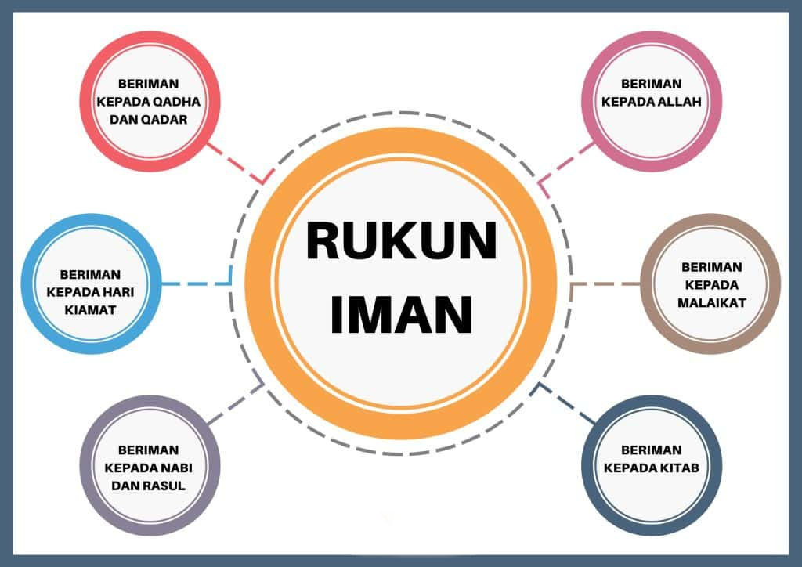

# Rukun Iman.

<figure><figcaption>
Rukun Iman.
</figcaption></figure>

Dalam pembahasan sebelum nya kita telah membahas apa itu Iman, Islam dan Ihsan. Maka dalam pembahasan kali ini kita akan membahas lebih dalam lagi tentang apa yang menjadi pondasi dasar yang menjadi ciri ciri seseorang itu berpegang teguh pada keimanan nya.

Seperti kita ketahui pada umum nya bahwa rukun iman terbagi menjadi 6 yaitu:

1.Iman kepada Allah\
2\. Iman kepada Malaikat\
3\. Iman kepada Nabi dan rasul Nya\
4\. Iman kepada Kitab\
5\. Iman kepada hari Akhir (Kiamat)\
6\. Iman kepada Qada dan Qadar (Takdir)

Mari kita urai kan satu persatu dari poin poin tersebut di atas, semoga menjadi iktiar kita bersama dalam membuka cakrawala berfikir kita dalam memahami nya.

**Iman kepada Qada dan Qadar**

Kita bahas dahulu dari poin paling bawah, yaitu Iman kepada Qada dan Qadar (takdir).

Mengapa kita membahas dari poin ini terlebih dahulu?

Karena ini adalah hal yang paling sederhana dan paling mendasar yang menjadi ukuran seseorang memegang teguh keimanan nya.

Secara umum, banyak dari kita yang mengartikan Qada dan Qadar, sebagai takdir baik dan takdir buruk yang sudah menjadi ketetapan Allah. Namun, jika kita telaah lebih dalam lagi takdir manapun yang Allah berikan kepada kita itu adalah dari sifat Rahman Rahim nya Allah sebagai bentuk kasih sayang terhadap hamba Nya.

Adapun baik dan buruk nya, itu adalah sudut pandang kita terhadap hal tersebut.

Contoh: Ketika Allah berkehendak menurunkan hujan di suatu tempat, maka turun lah hujan tersebut. Lalu bagi sebagian orang ada yang senang dengan hujan tersebut, namun ada juga yang tidak senang dengan hujan tersebut dengan berbagai alasan nya masing masing. Namun bagi Allah untuk orang yang senang, maupun orang yang tidak senang itu adalah yang terbaik bagi mereka karena Allah maha mengetahui segala sesuatu.

Mari kita telaah penggalan surat Al-An’am ayat 59 berikut ini:

“Wa ‘indahū mafātiḥul-gaibi lā ya‘lamuhā illā huw(a), wa ya‘lamu mā fil-barri wal-baḥr(i), wa mā tasquṭu miw waraqatin illā ya‘lamuhā wa lā ḥabbatin fī ẓulumātil-arḍi wa lā raṭbiw wa lā yābisin illā fī kitābim mubīn(in).”

Artinya: Kunci-kunci semua yang gaib ada pada-Nya; tidak ada yang mengetahuinya selain Dia. Dia mengetahui apa yang ada di darat dan di laut. Tidak ada sehelai daun pun yang gugur yang tidak diketahui-Nya. Tidak ada sebutir biji pun dalam kegelapan bumi dan tidak pula sesuatu yang basah atau yang kering, melainkan (tertulis) dalam kitab yang nyata (Lauh Mahfuz).

Dalam ayat di atas di jelaskan bahwa segala sesuatu bentuk takdir untuk semua makhluk nya telah tertulis di Lauh Mahfuz, maka kewajiban kita adalah berikhtiar untuk menerima segenap takdir tersebut karena itu adalah yang terbaik dari Allah untuk kita sebagai hamba Nya, terlepas apapun bentuk takdir nya.

karena jika kita menerima setiap takdir yang Allah berikan kepada kita, maka kita mengakui Allah adalah tuhan kita, sebalik nya jika kita tidak menerima segenap takdir Nya, maka kita mengingkari Allah sebagai tuhan kita dan termasuk golongan orang orang yang kufur, naudzubillah min dzalik.

Dan inilah ukuran paling sederhana ketika seseorang memiliki Iman dalam hati nya, yaitu dia menerima segenap takdir dalam hidup nya.

Selanjut nya, setelah kita mulai mengerti dan memahami dengan segenap hati bahwa setiap takdir adalah bentuk kasih sayang Allah kepada hamba Nya, dan kita mulai belajar menerima nya, maka kita akan menemukan satu titik bahwa orang yang di takdirkan susah tidak akan selama nya susah, begitupun sebalik nya, yang di takdir kan senang tidak akan selama nya senang.

**Iman kepada hari Akhir (Kiamat).**

Ya, semua perjalanan memiliki akhir. begitupun dengan perjalanan hidup kita. Ketika Allah menentukan batas waktu atas umur kita saat itu lah kehidupan kita di dunia ini akan berakhir.

“Kullu nafsin żā’iqatul-maut(i), ṡumma ilainā turja‘ūn(a).”

Artinya: Setiap yang bernyawa pasti akan merasakan kematian. Kemudian, hanya kepada Kami kamu dikembalikan.\
(QS: Al Ankabut ayat 57)

Dan akhir dari segala sesuatu yang ada di dunia ini, itulah yang dinamakan dengan kiamat, yaitu hari yang wajib kita yakini kedatangan nya untuk kita sebagai hamba yang beriman. Maka dari itu kita akan berikhtiar mempersiapkan amal terbaik untuk bekal kita di akhirat nanti.

Lalu selanjut nya, apa yang menjadi panduan untuk kita agar setiap amal ibadah yang kita jalankan menjadi ikhtiar dalam mempersiapkan bekal untuk hari tersebut?

**Iman kepada Kitab**.

Maka kita wajib meyakini kebenaran dari kitab yang Allah turunkan sebagai bentuk keimanan kita kepada Nya.

Alif lām mīm.

Żālikal-kitābu lā raiba fīh(i), hudal lil-muttaqīn(a).

Artinya: Kitab (Al-Qur’an) ini tidak ada keraguan di dalamnya; (ia merupakan) petunjuk bagi orang-orang yang bertakwa,

Al-lażīna yu’minūna bil-gaibi wa yuqīmūnaṣ-ṣalāta wa mimmā razaqnāhum yunfiqūn(a).

Artinya: (yaitu) orang-orang yang beriman pada yang gaib, menegakkan salat, dan menginfakkan sebagian rezeki yang Kami anugerahkan kepada mereka,

Wal-lażīna yu’minūna bimā unzila ilaika wa mā unzila min qablik(a), wabil-ākhirati hum yūqinūn(a).

Artinya: dan mereka yang beriman pada (Al-Qur’an) yang diturunkan kepadamu (Nabi Muhammad) dan (kitab-kitab suci) yang telah diturunkan sebelum engkau dan mereka yakin akan adanya akhirat.

Ulā’ika ‘alā hudam mir rabbihim wa ulā’ika humul-mufliḥūn(a).

Artinya: Merekalah yang mendapat petunjuk dari Tuhannya dan mereka itulah orang-orang yang beruntung.\
(QS: Al Baqarah ayat 1-5).

Inilah salah satu panduan yang Allah anugerahkan kepada setiap hamba Nya sebagai bekal untuk menjalani kehidupan nya. Dan untuk kita sebagai umat Islam, Allah turunkan Al Quran yang menjadi petunjuk untuk orang orang yang beriman.

Namun dari pada itu, kita pun harus memahami bahwa Allah tidak hanya menurunkan Al Quran sebagai kitab Nya, melainkan ada Taurat, Zabur, dan juga Injil.

Mengapa demikian?

Karena Allah memberikan panduan pedoman hidup untuk setiap hamba Nya sesuai dengan perkembangan zaman, dan untuk umat manusia yang hidup sesuai dengan zaman nya.

Dan kita wajib mengimani baik itu Zabur, Taurat, Injil dan Al Quran, semua nya adalah petunjuk dari Allah sebagai bentuk kasih sayang kepada hamba Nya. Dan kesemua kitab kitab tersebut mengajarkan hal yang sama, yaitu menuntun kita bagai mana menjalani hidup dalam jalan yang benar agar bisa membawa kita kepada keselamatan dunia dan akhirat.

Dan Al Quran, ini adalah kitab penyempurna dari kitab kitab sebelum nya, yang mana pedoman di dalam nya berlaku hingga akhir zaman karena ini merupakan kitab penutup, sehingga di sebut Rahmatan lil Alamin yang menjadi rahmat bagi alam semesta.

Inna fī hāżā labalāgal liqaumin ‘ābidīn(a).

Artinya: Sesungguhnya di dalam (Al-Qur’an) ini benar-benar terdapat pesan (yang jelas) bagi kaum penyembah (Allah).

Wa mā arsalnāka illā raḥmatal lil-‘ālamīn(a).

Artinya: Kami tidak mengutus engkau (Nabi Muhammad), kecuali sebagai rahmat bagi seluruh alam.\
(QS: AL-Anbiya ayat 106-107)

**Iman Kepada Nabi.**

Setelah kita mempelajari, memahami, hingga mengimani kitab Al Quran sebagai pedoman hidup, maka di sana kita akan mendapatkan banyak petunjuk yang Allah turunkan untuk hamba nya, dan juga terdapat kisah para nabi yang di ceritakan di dalam nya.

Diantara nya adalah kisah tentang Nabi Adam, Nabi Nuh, Nabi Ibrahim, Nabi Yunus, Nabi Musa, Nabi Daud, Nabi Isa, dan Nabi Muhammad S.A.W yang menjadi penutup dari para Nabi karena beliau adalah khatamun nabiyyin.

Mā kāna muḥammadun abā aḥadim mir rijālikum wa lākir rasūlallāhi wa khātaman-nabiyyīn(a), wa kānallāhu bikulli syai’in ‘alīmā(n).

Artinya: Muhammad itu bukanlah bapak dari seseorang di antara kamu, melainkan dia adalah utusan Allah dan penutup para nabi. Allah Maha Mengetahui segala sesuatu.\
(QS: Al-Ahzab ayat 40)

Dan kepada diantara para Nabi tersebut lah kitab kitab itu Allah turunkan, maka dari itu kita wajib beriman kepada para Nabi.

Ada 144.000 Nabi yang Allah turunkan sepanjang peradaban zaman, dan 313 di antara ya Allah angkat menjadi rasul. Dan untuk umat Islam 25 di antaranya wajib kita ketahui. Yang mana kisah nya banyak kita pelajari untuk di ambil hikhmah nya.

Dan dari semua para nabi dan rasul tersebut, dalam hal keimanan, tidak ada satupun yang berbeda. dalam artian semuanya sama sama mengajarkan kepada kita, bahwa semua kehidupan, kenyataan, kejadian, tidak ada yang terjadi begitu saja. melain kan ada yang menciptakan nya, ada yang mengurus dan menjaga nya, mengatur rejeki nya dan itu adalah Tuhan.

Lalu selanjut nya, setelah kita mengenal dan beriman kepada Nabi dan Rasul, maka akal kita akan bertanya, bagai mana para nabi tersebut mendapatkan wahyu dan mendapatkan kitab yang menjadi pedoman nya?

**Iman kepada Malaikat.**

Wan-najmi iżā hawā.

Artinya: Demi bintang ketika terbenam,

Mā ḍalla ṣāḥibukum wa mā gawā.

Artinya: kawanmu (Nabi Muhammad) tidak sesat, tidak keliru,

Wa mā yanṭiqu ‘anil-hawā.

Artinya: dan tidak pula berucap (tentang Al-Qur’an dan penjelasannya) berdasarkan hawa nafsu(-nya).

In huwa illā waḥyuy yūḥā.

Artinya: Ia (Al-Qur’an itu) tidak lain, kecuali wahyu yang disampaikan (kepadanya)

‘Allamahū syadīdul-quwā.

Artinya: yang diajarkan kepadanya oleh (malaikat) yang sangat kuat (Jibril)\
(QS: An-Najm ayat 1-5)

Penggalan surah di atas menerangkan bahwa Nabi Muhammad S.A.W mendapatkan wahyu berupa kitab Al Quran yang di sampaikan oleh malaikat Jibril atas perintah Allah.

Melalui perantara para malaikat malaikat Allah lah para Nabi dan rasul tersebut mendapatkan wahyu nya, kecuali nabi Musa yang mendapatkan wahyu langsung dari sifat Kalam nya Allah sehingga beliau bergelar Kalimullah.

Sebagai seorang muslim kita wajib beriman kepada para malaikat, karena mereka lah yang membawa perintah perintah Allah yang di tugaskan untuk keperluan seluruh makhluk nya.

Al-ḥamdu lillāhi fāṭiris-samāwāti wal-arḍi jā‘ilil-malāikati rusulā(n), ulī ajniḥatim maṡnā wa ṡulāṡa wa rubā‘(a), yazīdu fil-khalqi mā yasyā'(u), innallāha ‘alā kulli syai’in qadīr(un).

Artinya: Segala puji bagi Allah, Pencipta langit dan bumi yang menjadikan malaikat sebagai utusan-utusan (untuk mengurus berbagai macam urusan) yang mempunyai sayap. Masing-masing (ada yang) dua, tiga, dan empat. Dia menambahkan pada ciptaan-Nya apa yang Dia kehendaki. Sesungguhnya Allah Mahakuasa atas segala sesuatu.\
(QS: Fatir ayat 1)

Malaikat adalah makhluk ghaib yang Allah ciptakan dari cahaya, dan di antara para malaikat malaikat Allah, 10 diantara nya wajib kita ketahui sebagai berikut:

1.Jibril yang diperintah Allah untuk menyampaikan wahyu.\
2\. Mikail yang diperintah Allah untuk menyampaikan rejeki.\
3\. Israfil yang diperintah Allah untuk meniup sangkakala dihari Kiamat.\
4\. Izrail yang diperintah Allah untuk mencabut nyawa setiap makhluk nya saat ajal nya tiba.\
5\. Munkar yang diperintah Allah saat manusia berada di alam Kubur dan bertanya tentang perbuatan amal semasa hidup nya.\
6\. Nakir yang diperintah Allah saat manusia berada di alam Kubur dan bertanya tentang perbuatan amal semasa hidup nya.\
7\. Raqib yang diperintah Allah untuk mencatat setiap amal perbuatan baik yang di lakukan manusia selama hidup nya.\
8\. Atid yang diperintah Allah untuk mencatat setiap amal perbuatan buruk yang di lakukan manusia selama hidup nya.\
9\. Malik yang diperintah Allah untuk menjaga pintu Neraka.\
10\. Ridwan yang di perintah Allah untuk menjaga pintu Surga.

**Iman kepada Allah.**

Setelah kita beriman kepada Malaikat, yaitu makhluk ghaib yang Allah ciptakan atas kehendak nya, maka selanjutnya kita wajib beriman kepada sang khalik yang maha gahib, yaitu Allah subhannahu wa ta’ala.

Inilah tingkat keimanan paling tinggi sebagai makhluk terhadap pencipta Nya. dan panduan untuk koridor akal kita dalam mengenal dan meyakini keberadaan Nya telah saya uraikan dalam pembahasan sebelumnya melalui pembahasan 20 sifat wajib bagi Allah, yang di jabarkan menjadi 2 bagian yaitu bagian pertama menjabarkan tentang sifat nafsiah, salbiah dan ma’ani, lalu bagian kedua menjabarkan tentang sifat ma’nawiah.

Sampai disini dulu penjabaran tentang rukun iman, semoga tulisan ini menjadi ikhtiar kita bersama dalam memupuk, menumbuhkan, dan menguatkan keimanan kita sebagai makhluk kepada sang khalik.

Dimulai dari berikhtiar dalam menerima segenap takdir yang Allah anugerahkan kepada kita sebagai bentuk kasih sayang Nya, kemudian kita mempersiapkan bekal untuk perjalanan menuju akhirat nanti dengan mengikuti pedoman hidup yang tertulis dalam kitab Al Quran yang menjadi panduan nya, lalu kita menjalan kan ajaran syariat yang diajarkan oleh para nabi dan rasul sehingga kita berterima kasih kepada mereka dengan banyak bershalawat untuk para nabi, khusus nya Nabi Muhammad S.A.W. agar mendapatkan syafaat nya.

Selanjutnya kita mulai membenahi setiap peribadahan yang kita lakukan karena kita meyakini dengan segenap kesadaran bahwa setiap amal perbuatan kita dicatat oleh para Malaikat, hingga akhirnya catatan catatan amal tersebut akan Allah hisab ketika di yaumul mizan, saat kita akan kembali kepada Nya. Semoga kita termasuk kedalam golongan orang orang yang beriman.

Inna Lillahi wa inna ilayhi raji’un.

Terimakasih.

Jika anda memerlukan file PDF dari tulisan ini, silahkan [**Download disini.**](https://taufiksarif.files.wordpress.com/2024/04/rukun-iman.pdf)
